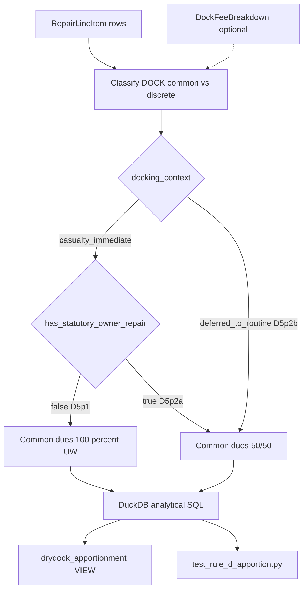

# AAA Rule D5 Drydock Apportionment: Rule Summary & Implementation Map

This document records the **Rules of Practice** that bound GitHub Issue [#29](https://github.com/edgesentry/marine-claims-AI/issues/29) (AAA drydock common-fee apportionment engine), and maps each clause to the open-core implementation.

Related docs: [Symbolic AI Implementation Framework](symbolic_ai_implementation_framework.md) · [R&D Roadmap](research_and_development_roadmap.md) Stage 1 · [Technical Stack](technical_stack.md).

Local primary-text cache (gitignored): `_inputs/rules_of_practice/` — see `_inputs/rules_of_practice/SOURCES.md`.

---

## 1. Scope of Issue #29

Issue #29 asks for a deterministic, in-process DuckDB solver that apportions **shared drydock dues** between shipowner and hull underwriter. The open-core side encodes only the **currency-neutral mathematical invariant**. Regional dock tariffs and labor rates stay outside the solver as adapter parameters.

| In scope | Out of scope (this issue) |
| :--- | :--- |
| London AAA **Rule D5** (DRY DOCK EXPENSES) owner ↔ underwriter split | Japan AAA **Rule 1** (PA + GA concurrent drydock → half to GA) |
| Classification of **common dock charges** vs discrete repair lines | Japan AAA **Rule 20** (split among multiple insured repair jobs) |
| Dual outcome: common dues **50/50** or **100% underwriter** | US/CA Great Lakes–specific rules beyond the C2 analogue |
| External `DockFeeBreakdown` / tariff injection | Hardcoded Setouchi / Jurong / Zhoushan rates in SQL |
| Unit tests on synthetic tenders | Rewiring `appraisal/pipeline.py` keyword “入出渠/滞渠 → 50%” (separate follow-up) |

**Citation note.** Issue #29 titles the rule “AAA Rule D”. In the London Rules of Practice the operative provision is **Section D, Rule D5** (“DRY DOCK EXPENSES”), not a free-standing “Rule D”. US/Canada RoP numbers the analogue **C2**.

---

## 2. Controlling primary sources

| Instrument | Public URL | Local cache | Role for #29 |
| :--- | :--- | :--- | :--- |
| Association of Average Adjusters (London) Rules of Practice — **D5** | Mirror: [UK-ROP.pdf](https://averageadjustersusca.org/images/UK-ROP.pdf) (official portal is membership-gated) | `AAA_UK_Rules_of_Practice.pdf` | **Controlling text** for owner ↔ underwriter common dues |
| Same substance, 1997 reprint | [rop1997.pdf](https://www.harvey-ashby.co.uk/rop1997.pdf) | `AAA_UK_Rules_of_Practice_1997_harvey_ashby.pdf` | Cross-check |
| AAA of the United States and Canada RoP (2016-10-05) — **C2** | [Rules-of-Practice-10-5-16.pdf](https://averageadjustersusca.org/images/Rules-of-Practice-10-5-16.pdf) | `AAA_USCA_Rules_of_Practice_2016-10-05.pdf` | Parallel wording; not a second algorithm |
| Association of Average Adjusters of Japan — Rules of Practice | [rules_02_ja.pdf](https://jpaverageadjusters.org/file/rules_02_ja.pdf) / [rules_en.pdf](https://jpaverageadjusters.org/file/rules_en.pdf) | `AAA_Japan_Rules_of_Practice_{ja,en}.pdf` | Adjacent market practice; **different predicates** (see §4) |

Precedents named in Issue #29 (*The Vancouver* 1886; *The Ruabon* 1900) inform the history of D5; they are not restated as separate code paths. *Lowndes & Rudolf* is a commercial treatise and is **not** cached in this repository.

---

## 3. Rule summary — London D5 (DRY DOCK EXPENSES)

D5 governs **particular average** drydock expenses when underwriters’ repairs and owners’ work may share a docking. The solver must distinguish three operative situations.

### 3.1 Paragraph 1 — casualty-driven docking; owners’ non-essential work

**Fact pattern.** Repairs for which underwriters are liable must be done in dry dock as an immediate consequence of the casualty (or the vessel is taken out of service especially for those repairs).

**Rule.** Cost of entering and leaving the dry dock, plus so much of the dock dues as is necessary for the damage repair, is chargeable **in full to underwriters**.

**Explicit non-trigger.** The shipowner may take advantage of the docking for classification survey or for repairs on owners’ account that are **not immediately necessary to make the vessel seaworthy**. That concurrent opportunistic work does **not**, by itself, force a 50/50 split under ¶1.

**Solver encoding.** `docking_context = casualty_immediate` and `has_statutory_owner_repair = false` → common dues **100% underwriter**.

### 3.2 Paragraph 2(a) — concurrent statutory (seaworthy-necessary) owners’ work

**Fact pattern.** Both of the following are true:

1. Owners’ repairs are **immediately necessary to make the vessel seaworthy** and can only be effected in dry dock; and
2. Underwriters’ repairs likewise can only be effected in dry dock; and both sets are executed concurrently.

**Rule.** Cost of entering and leaving, plus so much of the dock dues as is **common to both** repairs, is divided **equally** between shipowner and underwriters (even if underwriters’ repairs relate to more than one voyage/accident or more than one set of underwriters).

**Solver encoding.** `docking_context = casualty_immediate` and `has_statutory_owner_repair = true` → common dues **50/50**.

### 3.3 Paragraph 2(b) — underwriters’ repairs deferred to a routine docking

**Fact pattern.** Underwriters’ repairs are **deferred until a routine dry-docking**, then executed concurrently with owners’ account repairs that require the dry dock.

**Rule.** Entering/leaving plus common dock dues are divided **equally**, **whether or not** the owners’ repairs affect seaworthiness.

**Solver encoding.** `docking_context = deferred_to_routine` → common dues **50/50** (statutory predicate not required).

### 3.4 Paragraphs 3–4 — franchise / multi-underwriter subdivision

¶3 subdivides the underwriters’ share among voyages / franchise units in the policies. ¶4 addresses franchise calculation when part of drydock cost is chargeable to owners under ¶2(a).

**Issue #29.** Encode the **owner ↔ underwriter** math (¶1–¶2). Franchise / multi-policy subdivision (¶3–¶4) is deferred.

### 3.5 What counts as “common” dock charges

D5 applies to entering/leaving costs and dock dues (and, by market analogy / tender practice, pumping, wharfage, tug assistance treated as common docking services). Discrete structural or machinery work items are **not** split by D5; they remain fully to underwriter or owner according to casualty vs owners’ work classification.

---

## 4. Adjacent Japanese rules (recorded, not implemented in #29)

| Japan RoP | Substance | Relation to D5 |
| :--- | :--- | :--- |
| **Rule 1** (船渠料およびその他付帯費用) | When **particular average** and **general average** repairs that both require drydock run concurrently, **one-half** of common dock dues (entry/exit, lay, gas-free, etc.) is allowed in **general average**. | Different parties (PA vs GA), not owner vs H&M underwriter. |
| **Rule 20** (船渠料の負担方法) | When two or more **insured** repair jobs run together, apportion common docking costs **among those insurance works**. | Multi-claim split among underwriters’ jobs; not the D5 dual-necessity test. |

These clauses remain documented for Stage 1 regional adapters / later issues. They must **not** be folded into the universal D5 solver as if they were the same predicate.

---

## 5. Implementation map

### 5.1 Modules and symbols

| Rule element | Code / artifact | Notes |
| :--- | :--- | :--- |
| D5 solver entrypoint | `src/marine_claims_ai/analytics/rule_d_solver.py` | In-process DuckDB; `apportion_rule_d(...)` |
| Input line schema | `RepairLineItem` (`id`, `trade_code`, `cost`, optional `necessity`, `work_party`) | Currency-neutral `Decimal` amounts |
| Docking situation ¶1 / ¶2(a) vs ¶2(b) | `docking_context`: `casualty_immediate` \| `deferred_to_routine` | Required input; not inferred from trade codes alone |
| ¶2(a) seaworthiness predicate | `has_statutory_owner_repair` (SQL aggregate) | True if any owner line has `necessity='statutory_seaworthiness'` **or** trade prefix `SAFE-*` / `PROP-*` |
| Deferred / opportunistic owners’ work | `ENG-*`, `VALVE-*`, class-survey-only lines without statutory flag | Under `casualty_immediate`, does **not** trigger 50/50 (D5 ¶1) |
| Common dues lines | `trade_code` prefix `DOCK` | Separated from discrete hull/engine lines |
| Regional tariffs | `DockFeeBreakdown` via `adapters.base.ShipyardTariffAdapter` | Injected when invoice has no DOCK rows; never hardcoded in SQL |
| Analytics VIEW | `index/build.py` → `drydock_apportionment` | DOCK rows use D5 shares; discrete rows keep casualty/owner 100% |
| Summary CLI | `analytics/apportion.py`, `scripts/apportion_analytics.py` | Reads the VIEW; column compatibility preserved |
| Unit tests | `tests/test_rule_d_apportion.py` | Synthetic tenders; exact reconciliation |
| Indexing fixture follow-up | `tests/conftest.py`, `tests/test_indexing_and_apportion.py` | Include a `DOCK-*` line; drop “all repair × 0.5” expectations |

### 5.2 Apportionment outcomes (common dues only)

| `docking_context` | `has_statutory_owner_repair` | Result | D5 cite | Suggested `apportionment_rule` |
| :--- | :--- | :--- | :--- | :--- |
| `casualty_immediate` | false | insurer 100% / owner 0% | ¶1 | `RULE_D5_100_UNDERWRITER` |
| `casualty_immediate` | true | insurer 50% / owner 50% | ¶2(a) | `RULE_D5_50_50` |
| `deferred_to_routine` | (ignored) | insurer 50% / owner 50% | ¶2(b) | `RULE_D5_50_50` |
| (non-DOCK line) | — | full to casualty or owner party | n/a | `DISCRETE` |

Invariant: for every common-dues pool, `insurer_share + owner_share == common_dues_total`.

### 5.3 Test case ↔ clause map

| Test case | Inputs | Expected common dues | Clause |
| :--- | :--- | :--- | :--- |
| A | `casualty_immediate` + statutory owner (`SAFE-*`/`PROP-*`) + DOCK | 50/50 | D5 ¶2(a) |
| B | `casualty_immediate` + deferred only (`ENG-*`) + DOCK | 100% underwriter | D5 ¶1 |
| C | `deferred_to_routine` + any owners’ dock-required work + DOCK | 50/50 | D5 ¶2(b) |
| D | No DOCK rows; `DockFeeBreakdown.total` supplied | Same branch as A/B/C on injected total | Tariff boundary |
| E | Mixed DOCK + machinery lines | Only DOCK split; machinery not half-allocated | Common vs discrete |

---

## 6. Two-tier boundary (unchanged)

| Layer | Responsibility |
| :--- | :--- |
| **Universal open core** | D5 predicates and arithmetic in `rule_d_solver.py` / DuckDB SQL |
| **Regional adapters** | `get_docking_fee_structure`, hourly labor rates, jurisdiction catalogs under `config/jurisdictions/` and `adapters/` |

Deploying to another market must not rewrite D5 SQL. Changing Japan Rule 1 / Rule 20 behaviour belongs in adapters or a separate GA solver, not in the D5 core.

---

## 7. Explicit non-goals for this issue

1. Do not treat Japan Rule 1’s “half to general average” as identical to D5’s “half to owner”.
2. Do not apply 50/50 to every repair line (the pre-#29 placeholder VIEW / pipeline keyword rule).
3. Do not commit proprietary tariffs, real vessel invoices, or copyrighted treatise extracts into git.
4. Do not implement D5 ¶3–¶4 franchise subdivision in the first solver cut.
