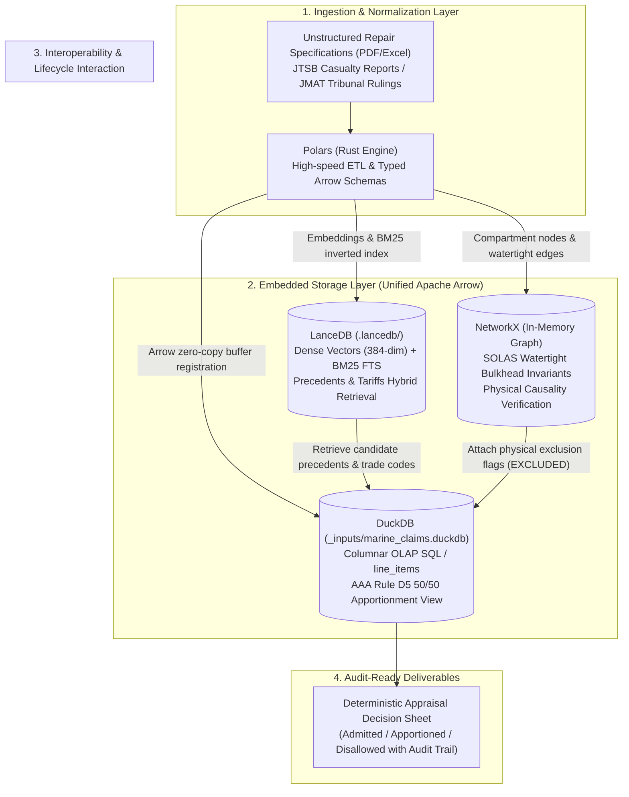
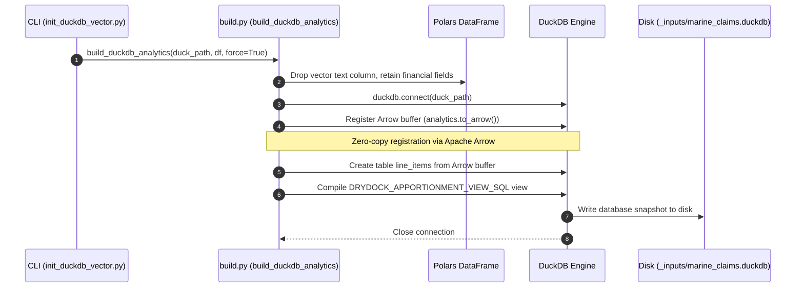
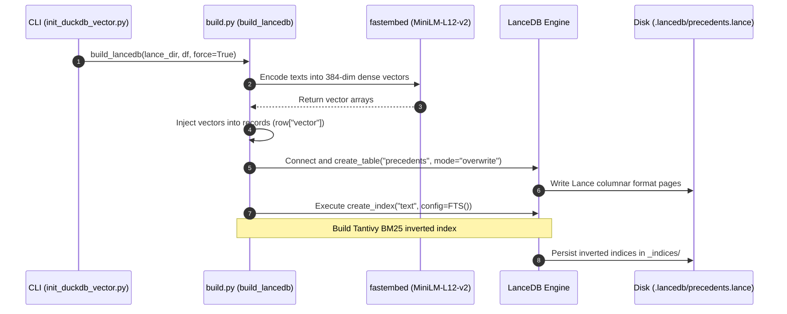
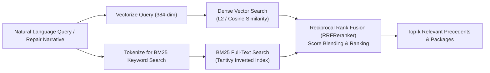
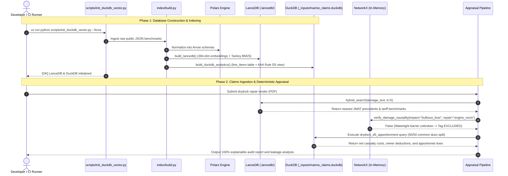

# Database Architecture, Design Rationales & Lifecycle Management

**Target Project**: `marine-claims-ai` (Public Open-Core)  
**Audience**: Software Architects, Data Engineers, Claims Appraisal Engineers, PoC Technical Leads  
**Last Updated**: 2026-09-27  
**Related Documents**: [`technical_stack.md`](technical_stack.md) · [`aaa_rule_d5_drydock_apportionment.md`](aaa_rule_d5_drydock_apportionment.md) · [`symbolic_ai_implementation_framework.md`](symbolic_ai_implementation_framework.md)

---

## 1. Executive Summary & Database Inventory

MarineClaims AI deliberately avoids running persistent, external database servers (such as PostgreSQL, MySQL, or Neo4j). Instead, it implements an **embedded, serverless, in-process architecture** designed for **zero external dependencies, strict air-gap compliance, and reproducible zero-copy data processing**.

The system utilizes two embedded storage engines and one in-memory graph structure, all unified by the **Apache Arrow** columnar standard:

| Database / Engine | Engine Type & Format | Storage Path (Filesystem) | Core Purpose & Responsibilities |
| :--- | :--- | :--- | :--- |
| **DuckDB** | In-process columnar OLAP SQL engine (C++) | `_inputs/marine_claims.duckdb` `_inputs/marine_claims_thin.duckdb` In-memory: `:memory:` | • **AAA Rule D5 drydock common dues 50/50 apportionment** • Analytical queries and financial aggregations on `line_items` • Deterministic calculation of Claims Leakage (unwarranted owner expenses) |
| **LanceDB** | Embedded hybrid vector + full-text search DB (Rust / Lance) | `.lancedb/precedents.lance` `.lancedb_thin/precedents.lance` | • **Hybrid retrieval (Dense Vector + BM25 FTS) across maritime corpora** • Fast retrieval of JMAT tribunal rulings, PSC deficiency flags, repair work packages, and civil court precedents |
| **NetworkX** | In-memory directed topology graph (Python) | Runtime memory (`nx.DiGraph`) | • **Naval architecture watertight bulkhead isolation testing** • Deterministic physical reachability verification (`has_path`) to mechanically reject impossible damage propagation (`EXCLUDED`) |

---

## 2. Architectural & Design Rationales

Rather than adopting traditional client-server relational databases or cloud DB instances, the data tier of MarineClaims AI is governed by five domain-specific design principles:

### 1. Zero-Server & Zero-Maintenance (Embedded In-Process Runtime)
* **Problem**: In marine insurance companies (e.g., MS&AD / MSIG, Tokio Marine) and average adjusting firms (Braemar, NKKK), corporate IT and cybersecurity policies strictly forbid unapproved background server daemons, open database listening ports, or Docker container runtimes on local adjuster workstations.
* **Design Solution**:
  * DuckDB and LanceDB run entirely **in-process** via native shared libraries (C++ and Rust).
  * Setup requires only standard Python package installation (`pip install duckdb lancedb`), with zero daemon management, zero network port exposure, and zero background resource consumption when idle.

### 2. Zero-Dataset Git Policy & Strict Air-Gap Security
* **Problem**: Marine claims files contain confidential vessel identifiers (IMO numbers, hull names, proprietary charter party terms, owner identities, and contested repair figures). Committing binary databases or sensitive claim dossiers to Git creates severe data leakage risks.
* **Design Solution**:
  * Binary database artifacts (`*.duckdb`, `.lancedb/`) are strictly gitignored.
  * The database state is **100% reproducible and programmatic** (Idempotent Rebuild). Any developer or CI/CD runner can reconstruct the entire index from scratch using automated ingestion scripts ([`scripts/fetch_public_datasets.py`](../scripts/fetch_public_datasets.py) and [`scripts/init_duckdb_vector.py`](../scripts/init_duckdb_vector.py)).

### 3. Unified Apache Arrow Columnar Standard (Zero-Copy Interoperability)
* **Problem**: Iterating over 1,000–3,000 line items per repair specification using Pandas or JSON serialization creates significant CPU overhead, garbage collection pauses, and memory bloating.
* **Design Solution**:
  * **Polars (ETL) ↔ LanceDB (Search) ↔ DuckDB (OLAP)** operate over a shared **Apache Arrow** columnar memory format.
  * Tabular data transfers incur zero serialization or memory copying, enabling sub-second end-to-end evaluation across large-scale repair tenders.

### 4. Neuro-Symbolic Determinism & Anti-Hallucination Guarantees
* **Problem**: Empirical studies (e.g., Stanford CodeX, Kant et al. 2025) demonstrate that standalone generative Large Language Models (LLMs) suffer a 12–22% failure rate when arbitrating strict policy exclusions and mathematical apportionments.
* **Design Solution**:
  * LLMs are restricted strictly to text extraction and schema normalization.
  * All legal reasoning and physical constraint validations are delegated to **deterministic symbolic engines**:
    * Information retrieval is delegated to **LanceDB** (Dense Vector + BM25).
    * Spatial and damage propagation constraints are delegated to **NetworkX** (graph invariants).
    * Accounting, deductible offsets, and drydock fee divisions are delegated to **DuckDB** (formal SQL views).

### 5. Serverless Scalability & Cost-Effective Disaster Recovery
* **Problem**: Enterprise relational and vector database clusters incur substantial monthly hosting and administration fees.
* **Design Solution**:
  * Both Lance (Lance format) and DuckDB (Parquet format) decouple compute from storage.
  * Database states can be snapshotted and synchronized directly to S3-compatible cloud object storage (Cloudflare R2, AWS S3) via native extensions (`httpfs` and Lance native S3 connector), achieving high durability and fast recovery (< 15 min RTO) without ongoing server costs.

---

## 3. Deep Dive into Database Engines: Write & Read Specifications

---

### 3.1 DuckDB: Analytical Relational SQL Engine

#### Primary Responsibilities
1. **AAA Rule D5 Common Dues Apportionment**: Applies London Association of Average Adjusters (AAA) Rule D5 to divide shared drydocking dues (dock entry/exit, daily lay-dock dues) 50/50 between underwriter and owner when casualty repairs and routine owner maintenance coincide.
2. **Claims Leakage & Disallowance Aggregation**: High-speed OLAP calculation of discrete casualty expenses, owner-deferred maintenance, statutory class requirements, and disallowed line items.

#### Filesystem Locations
* Persistent local databases: `_inputs/marine_claims.duckdb` (full corpus), `_inputs/marine_claims_thin.duckdb` (CI/test corpus).
* Dynamic in-memory runtime: `duckdb.connect(":memory:")`.
* Default path definitions: [`src/marine_claims_ai/paths.py`](../src/marine_claims_ai/paths.py) (`DEFAULT_DUCK_PATH`).

#### Write Pipeline (Update & Table Generation)
DuckDB tables and analytical views are built programmatically without manual database migrations:

* **Entrypoint & Function Location**:
  * Script Entrypoint: [`scripts/init_duckdb_vector.py`](../scripts/init_duckdb_vector.py)
  * Implementation Function: [`src/marine_claims_ai/index/build.py`](../src/marine_claims_ai/index/build.py) (`build_duckdb_analytics`)
  * Mathematical Logic Specification: [`src/marine_claims_ai/analytics/rule_d_solver.py`](../src/marine_claims_ai/analytics/rule_d_solver.py) (`DRYDOCK_APPORTIONMENT_VIEW_SQL`)
* **Step-by-Step Execution Flow**:
  1. The dataset builder extracts normalized records from public benchmarks (JMAT cases, PSC flags, repair packages, civil court precedents) into a `polars.DataFrame`.
  2. Vector text fields (`text`) are dropped to keep the analytical table compact and typed for financial calculations.
  3. The `Polars` dataframe is registered into an active DuckDB connection using Apache Arrow zero-copy memory buffers (`to_arrow()`).
  4. The physical `line_items` table is instantiated directly from the registered Arrow buffer.
  5. The formal AAA Rule D5 apportionment view (`drydock_d5_apportionment`) is compiled into DuckDB catalog space.
  6. The transaction is committed and the database file is closed cleanly.
* **Dynamic In-Memory Apportionment Workflow**:
  * Function Location: [`src/marine_claims_ai/analytics/rule_d_solver.py`](../src/marine_claims_ai/analytics/rule_d_solver.py) (`apportion_drydock_common_dues`)
  * For live claim evaluations, DuckDB opens an in-memory instance (`:memory:`), injects line items and dock fee parameters as an Arrow table, and executes the compiled Rule D5 view dynamically.

#### Read Pipeline (Querying & Financial Summary)
Reading occurs exclusively in read-only mode to prevent lock contention:

* **Function Location**: [`src/marine_claims_ai/analytics/apportion.py`](../src/marine_claims_ai/analytics/apportion.py) (`summarize_claims_leakage`)
* **Execution Flow**:
  1. Connects to `marine_claims.duckdb` with the read-only flag enabled (`read_only=True`).
  2. Executes multi-dimensional group-by aggregations grouping by `domain` (e.g., `repair`, `jmat`, `psc`, `civil_court`).
  3. Computes sums for total claimed amounts, disallowed sums (owner-account items and concurrent maintenance), and net awarded damages.
  4. Formats results into structured Python dictionaries for downstream audit reporting and KPI dashboards.

---

### 3.2 LanceDB: Embedded Hybrid Vector & Full-Text Search Engine

#### Primary Responsibilities
1. **Hybrid Retrieval (Dense Vector + BM25)**: Performs unified semantic search and exact-match keyword querying over JMAT tribunal cases, PSC risk profiles, repair work packages, and civil court precedents.
2. **Multilingual Terminology Matching**: Resolves domain-specific variations between Japanese and English ship repair terminology (e.g., Japanese shipyard terms vs. English classification society terminology).

#### Filesystem Locations
* Persistent local directories: `.lancedb/precedents.lance` (standard corpus), `.lancedb_thin/precedents.lance` (thin test corpus).
* Default directory definitions: [`src/marine_claims_ai/paths.py`](../src/marine_claims_ai/paths.py) (`DEFAULT_LANCE_DIR`).

#### Write Pipeline (Embedding & Index Creation)
LanceDB datasets are created and indexed through automated vectorization:

* **Entrypoint & Function Location**:
  * Script Entrypoint: [`scripts/init_duckdb_vector.py`](../scripts/init_duckdb_vector.py)
  * Implementation Function: [`src/marine_claims_ai/index/build.py`](../src/marine_claims_ai/index/build.py) (`build_lancedb`)
  * Embedding Configuration: [`src/marine_claims_ai/index/build.py`](../src/marine_claims_ai/index/build.py) (`EMBED_MODEL = "sentence-transformers/paraphrase-multilingual-MiniLM-L12-v2"`, dimension = 384)
* **Step-by-Step Execution Flow**:
  1. Texts from benchmark passages are passed in batches to the `fastembed` multilingual embedding model.
  2. 384-dimensional dense float vectors are generated for each passage and validated against the dimension invariant.
  3. The dense vectors are attached to individual record dictionaries (`row["vector"]`).
  4. LanceDB connects to the target directory and creates or overwrites the `precedents` table using native Lance columnar storage.
  5. A Tantivy-backed full-text search index (FTS) is built over the `text` column to enable sub-millisecond BM25 keyword retrieval.

#### Read Pipeline (Hybrid Search & Reciprocal Rank Fusion)
Search queries are processed using hybrid ranking:

* **Function Location**: [`src/marine_claims_ai/index/search.py`](../src/marine_claims_ai/index/search.py) (`hybrid_search`, `embed_query`)
* **Execution Flow**:
  1. The user query (e.g., incident description, casualty circumstances, or repair work item) is converted into a 384-dimensional query vector.
  2. LanceDB executes a hybrid query combining dense vector similarity (cosine / L2 distance) and BM25 full-text keyword matching simultaneously.
  3. The `RRFReranker` (Reciprocal Rank Fusion) reconciles disparate score distributions from vector and lexical searches to calculate a fused rank.
  4. The top $k$ matching precedent records (including precedent ID, title, domain, text, and ranking metadata) are returned to the caller.

---

### 3.3 NetworkX: In-Memory Naval Architecture Compartment Graph

#### Primary Responsibilities
1. **Watertight Bulkhead Invariant Enforcement**: Models the physical topology of vessel spaces according to SOLAS (International Convention for the Safety of Life at Sea) standards.
2. **Causality Barrier**: Mechanically verifies whether casualty damage at an impact compartment (e.g., forward bulbous bow) can physically propagate across watertight bulkheads (e.g., collision bulkhead) to claimed repair items in aft compartments (e.g., engine room or steering gear flat). If unreachable, items are assigned `EXCLUDED`.

#### Filesystem Locations
* Pure runtime in-memory instance (`networkx.DiGraph`).
* Ontology definition file: [`src/marine_claims_ai/ontology/compartments.py`](../src/marine_claims_ai/ontology/compartments.py).
* Causal evaluation module: [`src/marine_claims_ai/analytics/graph_barrier.py`](../src/marine_claims_ai/analytics/graph_barrier.py).

#### Write Pipeline (Graph Instantiation)
The graph is generated dynamically from the structural ontology during runtime initialization:

* **Function Location**: [`src/marine_claims_ai/ontology/compartments.py`](../src/marine_claims_ai/ontology/compartments.py) (`build_standard_vessel_compartment_graph`)
* **Structure & Attributes**:
  * Compartment nodes represent structural spaces from bow to stern (e.g., `bulbous_bow`, `forepeak_tank`, cargo holds, `cofferdam_fwd`, `engine_room`, `shaft_tunnel`, `steering_gear_room`).
  * Directed edges represent physical connectivity.
  * Edges corresponding to intact transverse watertight bulkheads (Collision Bulkhead, Forward Machinery Bulkhead, Aft Peak Bulkhead) are tagged with structural barrier metadata (`barrier=True`).

#### Read Pipeline (Path Reachability Verification)
Evaluates whether claim items have an unbroken path of physical causality from the casualty origin:

* **Function Location**: [`src/marine_claims_ai/analytics/graph_barrier.py`](../src/marine_claims_ai/analytics/graph_barrier.py) (`evaluate_damage_propagation`, `verify_damage_causality`)
* **Execution Flow**:
  1. Creates a filtered subgraph view that excludes all edges where `barrier=True` (intact watertight bulkheads).
  2. Performs deterministic path reachability analysis (`nx.has_path`) between the known impact node (e.g., `bulbous_bow`) and the target repair compartment (e.g., `engine_room`).
  3. If no physical path exists, the item is tagged with `casualty_related = False` and marked `EXCLUDED`.
  4. This flag directly drives DuckDB's Rule D5 solver, disallowing casualty coverage for the disconnected work items.

---

## 4. End-to-End System Execution Sequence

The complete operational lifecycle from developer initialization to claims appraisal is illustrated below:

---

## 5. Developer & Operations Command Playbook

All operations are executed via documented CLI entrypoints without requiring direct database console interventions:

### 1. Database Creation & Idempotent Rebuild
* Refresh public benchmark datasets into local cache:
  * Script: [`scripts/fetch_public_datasets.py`](../scripts/fetch_public_datasets.py) (`--force`)
* Reconstruct DuckDB and LanceDB from scratch:
  * Script: [`scripts/init_duckdb_vector.py`](../scripts/init_duckdb_vector.py) (`--force`)

### 2. Information Retrieval & Hit@k Scale Testing
* Evaluate LanceDB hybrid search recall (hit@5 and hit@10) across benchmark queries:
  * Script: [`scripts/eval_retrieval_scale.py`](../scripts/eval_retrieval_scale.py)

### 3. Automated Regression & Accuracy Verification
* Verify concurrent repair exclusion and Rule D5 apportionment against public drydock cases:
  * Script: [`scripts/eval_public_appraisal.py`](../scripts/eval_public_appraisal.py) (`--fail-on-gate`)
* Run comprehensive multi-field validation (JMAT geometry, PSC scoring, tender pricing):
  * Script: [`scripts/verify_3fields_benchmarks.py`](../scripts/verify_3fields_benchmarks.py)

### 4. Local Snapshot & Off-Machine Disaster Recovery
* Export DuckDB snapshot to Parquet:
  * CLI Command: `duckdb _inputs/marine_claims.duckdb "EXPORT DATABASE 'backup/duckdb_snapshot/' (FORMAT PARQUET);"`
* Archive LanceDB index directory:
  * CLI Command: `tar -czf backup/lancedb_$(date +%Y%m%d).tar.gz .lancedb/`
* Synchronize local databases and cached datasets to Cloudflare R2 / AWS S3:
  * CLI Command: `rclone sync _inputs/ r2:marine-claims-backup/_inputs/ --fast-list`
  * CLI Command: `rclone sync .lancedb/ r2:marine-claims-backup/lancedb/ --fast-list`
