# Data Tier Directory Structure & Governance Specification

**Target Project**: `marine-claims-ai` (Public Open-Core)  
**Audience**: Developers, Data Engineers, Autonomous Agents, Marine Claims Adjusters  
**Governance Authority**: [AGENTS.md](../AGENTS.md) Section 2.B (*Zero-Dataset Git Policy*)  
**Related Documents**: [`database_architecture_and_lifecycle.md`](database_architecture_and_lifecycle.md) · [`getting_started.md`](getting_started.md)

---

## 1. Core Principles: 3-Tier Architecture

To eliminate dataset pollution, prevent accidental git commits of large binaries, and maintain a rigorous zero-confidential-data barrier, the local workspace is strictly segregated into three distinct runtime directories:

```mermaid
flowchart LR
    subgraph INPUTS["1. _inputs/ (Raw / Read-Only)"]
        direction TB
        RAW_PDF["Public Specs & Bids (PDF)"]
        RAW_REP["Casualty Reports (JTSB/JMAT)"]
        RAW_CRT["Civil Precedents (PDF/HTML)"]
        RAW_STD["Standards & Treaties"]
    end

    subgraph DATA["2. _data/ (Derived / Storage)"]
        direction TB
        DUCK[("DuckDB (_data/duckdb/)")]
        DUCK[("DuckDB (_data/duckdb/)")]
        BENCH["Benchmarks & Gold JSON"]
        CACHE["Render & OCR Caches"]
    end

    subgraph LOGS["3. _logs/ (Audit & Operational)"]
        direction TB
        RUN_LOG["demo.log / eval.log"]
        AUDIT["Audit Trail Logs"]
    end

    INPUTS -->|"Ingest, Parse & Embed"| DATA
    DATA -->|"Analytics & Verification"| LOGS
```



1. **`_inputs/` (Raw External Documents — Read-Only)**:
   - Houses only un-manipulated external source documents (PDFs, HTML files, official gazettes).
   - Treated strictly as **read-only** by application pipelines and agents; no generated intermediate artifacts or database files may be written here.
2. **`_data/` (Derived Storage & Structured Artifacts — Ephemeral / Rebuildable)**:
   - Houses embedded databases (DuckDB), pre-extracted benchmark evaluation JSON files, and rendering/OCR caches.
   - All files in `_data/` must be 100% regenerable on-demand from `_inputs/` via scripts.
3. **`_logs/` (Operational Logs & Audit Trail)**:
   - Houses runtime diagnostics, evaluation benchmark metrics, and adjuster override audit logs.
   - Completely decoupled from data storage to allow log rotation and archiving without affecting database handles.

All three tiers (`_inputs/`, `_data/`, `_logs/`) are strictly gitignored per `AGENTS.md`.

---

## 2. Directory Hierarchy & Placement Rules

### 2.1 `_inputs/` (Raw Public Documents)

Subfolders are organized according to screening priority use cases:

```text
_inputs/
├── repairs/                      # [Screening Priority 1: H&M Drydock Appraisal]
│   ├── specs/                    # Public vessel repair specifications & tender PDFs (10–15 vessels)
│   │   ├── fukuoka_kaiyomaru_spec.pdf
│   │   └── sample_drydock_repair_specification.pdf
│   └── bids/                     # Awarded contract notices & government bid results (20–30 notices)
│       └── fukuoka_ship_bid_result.pdf
│
├── casualties/                   # [Screening Priority 2: Tribunal & Casualty Reports]
│   ├── jtsb/                     # JTSB Marine Accident Investigation Reports (PDF, 200+ reports)
│   │   ├── jtsb_cargo_collision_report.pdf
│   │   └── jtsb_tanker_bridge_collision_report.pdf
│   └── jmat/                     # JMAT Maritime Tribunal Rulings (HTML / Text, 100 rulings)
│
├── legal/                        # [Screening Priority 2: Judicial Precedents]
│   └── civil_court/              # Supreme / District Court maritime precedents (courts.go.jp)
│       ├── pdfs/                 # Judicial decision PDFs
│       └── html/                 # Full judgment text HTML
│
├── charter_party/                # [Screening Priority 3: Loss of Hire (LOH)]
│   ├── logbooks/                 # Shipyard daily work progress logs & completion certificates
│   └── forms/                    # Standard charter party off-hire clauses (NYPE, BIMCO)
│
├── reinsurance/                  # [Screening Priority 4: Reinsurance]
│   └── slips/                    # Lloyd's MRC format slip templates & claims cooperation clauses
│
└── standards/                    # [Shared Statutory References & Standards]
    ├── colregs/                  # 1972 COLREGS convention articles & Japanese Act text
    ├── rules_of_practice/        # Association of Average Adjusters Rules of Practice (Rule D5)
    ├── psc/                      # Paris / Tokyo MOU inspection annual reports & deficiency lists
    └── papers/                   # Public academic papers & naval architecture domain references
```

### 2.2 `_data/` (Databases, Benchmarks & Intermediate Caches)

```text
_data/
├── duckdb/                       # Embedded In-Process Columnar OLAP Engine
│   ├── marine_claims.duckdb      # Primary analytical database (Rule D5 apportionment, line items)
│   └── marine_claims_thin.duckdb # Lightweight fixture database for fast CI test suites
│
├── duckdb/                       # Embedded analytics + vector/keyword retrieval
│   └── marine_claims.duckdb      # precedents (embeddings) + line_items + Rule D5 VIEW
│
├── benchmarks/                   # Standardized Benchmark Ground Truth & Structured Corpora
│   ├── field1_jmat_cases.json    # JMAT 100-case structured benchmark
│   ├── field2_psc_flags.json     # PSC flag state risk tiers
│   ├── field3_repair_packages.json # Repair trade codes and cost packages
│   ├── court_civil_cases.json    # 60–80 civil court collision precedents
│   └── gold/                     # Expert surveyor provisional & reviewed gold labels
│
└── cache/                        # Transient intermediate files & UI previews
    ├── pdf_pages/                # Rendered PNG/JPEG pages for demo visual verification UI
    └── ocr/                      # Raw OCR JSON / character bounding box geometry
```

### 2.3 `_logs/` (Operational Logs & Audit Trail)

```text
_logs/
├── demo.log                      # Demo CLI diagnostic log (rotating)
├── appraisal_eval.log            # Accuracy benchmark test execution & metric reports
└── audit_trail/                  # Immutable adjuster review & override audit logs (enterprise copilot)
```

---

## 3. Path Management & Code Conventions

All internal modules and CLI scripts must resolve file locations via **`marine_claims_ai.paths`**. Direct hardcoding of relative paths (e.g. `open("_inputs/foo.pdf")`) is strictly forbidden.

### Standard Paths in `src/marine_claims_ai/paths.py`

| Constant | Resolved Path | Purpose |
| :--- | :--- | :--- |
| `DEFAULT_INPUTS_DIR` | `<repo>/_inputs` | Base directory for raw documents |
| `DEFAULT_INPUT_REPAIRS_DIR` | `<repo>/_inputs/repairs` | Repair specifications and bids |
| `DEFAULT_INPUT_CASUALTIES_DIR` | `<repo>/_inputs/casualties` | JTSB and JMAT casualty reports |
| `DEFAULT_INPUT_JMAT_DIR` | `<repo>/_inputs/casualties/jmat` | JMAT tribunal rulings (HTML/text) |
| `DEFAULT_INPUT_JTSB_DIR` | `<repo>/_inputs/casualties/jtsb` | JTSB marine accident reports |
| `DEFAULT_INPUT_LEGAL_DIR` | `<repo>/_inputs/legal` | Civil court judicial precedents |
| `DEFAULT_INPUT_CIVIL_COURT_DIR` | `<repo>/_inputs/legal/civil_court` | courts.go.jp PDFs/HTML cache |
| `DEFAULT_DATA_DIR` | `<repo>/_data` | Base directory for derived databases and caches |
| `DEFAULT_DUCK_DIR` | `<repo>/_data/duckdb` | DuckDB database directory |
| `DEFAULT_DUCK_PATH` | `<repo>/_data/duckdb/marine_claims.duckdb` | Primary DuckDB database file |
| `DEFAULT_DUCK_PATH` | `<repo>/_data/duckdb/marine_claims.duckdb` | DuckDB analytics + retrieval database |
| `DEFAULT_BENCHMARK_DIR` | `<repo>/_data/benchmarks` | Benchmark JSON corpora |
| `DEFAULT_CACHE_DIR` | `<repo>/_data/cache` | Intermediate preview and OCR caches |
| `DEFAULT_LOG_DIR` | `<repo>/_logs` | Operational and audit log directory |

---

## 4. Relationship with `AGENTS.md` Directives

Per **[AGENTS.md](../AGENTS.md) Section 2.B**:
> *“NEVER commit raw external documents (PDFs, HTML files), private spreadsheets (CSV, TSV), or extracted benchmark JSON files to this Git repository.*  
> *All evaluation data must be generated or fetched on-demand into gitignored local cache directories (`_inputs/`, `_data/`, `_logs/`).”*

This governance document formalizes the subfolder organization of `_inputs/`, `_data/`, and `_logs/` so that automated ingest scripts (`fetch_public_datasets.py`), retrieval indexers, and evaluation harnesses operate in strict compliance with the Zero-Dataset policy without data collisions.
