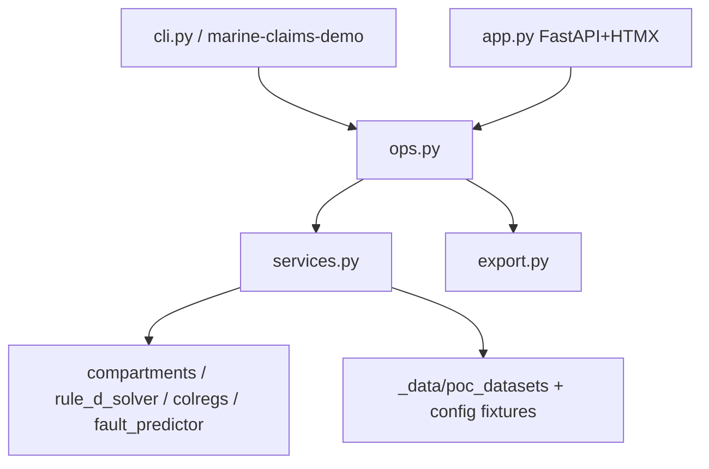

# Executive Demo: CLI & Web UI Parity (Issue #54)

Offline interactive demo for the three pitch use cases — watertight topology / owner's work exclusion, AAA Rule D5 apportionment & off-hire, and COLREGS fault evidence — with **English / 日本語** UI strings.

Related: [Getting Started](getting_started.md) · [AAA Rule D5](aaa_rule_d5_drydock_apportionment.md) · [COLREGS engine](colregs_encounter_engine.md) · [Public benchmarks](public_benchmarks_and_accuracy_evaluation.md) · [Technical stack](technical_stack.md) · GitHub [Issue #54](https://github.com/edgesentry/marine-claims-AI/issues/54).

---

## 1. Design rules

| Rule | Detail |
| :--- | :--- |
| **One ops layer** | CLI and Web call the same `marine_claims_ai.demo.ops` (run / export / text summary). Do not fork business logic into templates or argparse handlers. |
| **CLI without demo deps** | `uc1` / `uc2` / `uc3` / `list-cases` need only the core package. FastAPI is required only for `serve`. |
| **Local data under `_data/`** | Default caches: `_data/poc_datasets/`, `_data/marine_claims.duckdb`. Legacy `_inputs/poc_datasets/` is a read fallback. Never commit raw PDFs or extracted JSON. |
| **Offline Web assets** | HTMX and Chart.js are vendored under `src/marine_claims_ai/demo/static/vendor/` (see `NOTICE`). No CDN at runtime. |
| **Public metrics only** | Show measured values from local caches / fixtures. Do not hardcode pitch round-numbers or confidential commercial narratives. |
| **EN/JA in demo layer** | Strings live in `demo/i18n.py`. Core Lloyd's English `appraisal.report` stays English; Japanese survey export is a demo-layer wrapper. |

---

## 2. Layout

```text
src/marine_claims_ai/demo/
├── ops.py              # shared run_* / export_* / format_* (CLI + Web)
├── services.py         # UC view-models (engines + fixtures)
├── export.py           # Markdown + printable HTML
├── i18n.py             # EN/JA catalog
├── loaders.py          # _data (preferred) / _inputs (legacy)
├── cli.py              # marine-claims-demo
├── app.py              # FastAPI + Jinja2 + HTMX
├── templates/          # UC pages + HTMX partials
└── static/             # demo.css + vendor/

scripts/run_demo_cli.py # thin → demo.cli:main
scripts/run_demo_app.py # thin → demo.cli serve
```



---

## 3. Use cases

| Command / route | Capability |
| :--- | :--- |
| `uc1` / `/uc1` | Kaiyo Maru cached analysis + compartment graph + Preliminary Survey export |
| `uc2` / `/uc2` | Rule D5 50/50 common dues, Gantt, off-hire slider params, apportionment export |
| `uc3` / `/uc3` | JMAT fixtures + civil seed `civil_7` (あたご・清徳丸 70:30), radar scope, COLREGS memo export |
| `list-cases` | Print UC3 case ids |
| `serve` / `run_demo_app.py` | Web UI on `http://127.0.0.1:8765/` |

UC2 knobs (identical in CLI flags and Web query/sliders): `--daily-dock-rate`, `--dock-days`, `--hire-rate`, `--legacy-lead-days`, `--ai-lead-minutes`.

---

## 4. How to run

```bash
# CLI (core install is enough)
uv run marine-claims-demo uc1 --lang ja
uv run marine-claims-demo uc2 --dock-days 5 --export-md _data/rule_d5.md
uv run marine-claims-demo list-cases
uv run marine-claims-demo uc3 --case civil_7 --export-md _data/colregs.md
uv run marine-claims-demo uc1 --json

# Web UI
uv sync --group demo
# Ensure _data/poc_datasets/claims_analysis_kaiyomaru.json exists
# (or legacy _inputs/poc_datasets/ copy)
uv run marine-claims-demo serve
# equivalent: uv run python scripts/run_demo_app.py
```

Language: `--lang en|ja` on each CLI subcommand; Web uses `/set-lang?lang=…` (Cookie `demo_lang`).

Local E2E (optional; **not** part of CI):

```bash
uv sync --group demo
uv run pytest -m demo -q
```

---

## 5. Data prerequisites

| Artifact | Location | Notes |
| :--- | :--- | :--- |
| Kaiyo Maru analysis JSON | `_data/poc_datasets/claims_analysis_kaiyomaru.json` | Required for UC1; produce via appraisal pipeline / eval, or copy from legacy cache |
| JMAT COLREGS fixtures | `config/jmat_collision_eval.json` | Tracked; offline |
| Collision geometries | `config/collision_geometries.json` | Tracked |
| Civil seeds (e.g. case 7) | `config/civil_precedent_catalog.json` → `seeds` | Tracked summaries only |

Paths are defined in `marine_claims_ai.paths` (`DEFAULT_DATA_DIR`, `DEFAULT_DATASET_DIR`, `LEGACY_DATASET_DIR`).

---

## 6. Agent / contributor notes

When extending the demo:

1. Add or change behavior in **`ops.py` / `services.py` / `export.py` first**, then wire CLI and Web.
2. Keep new strings in **`i18n.py`** with both `en` and `ja` keys; tests assert key symmetry.
3. Respect **Zero-Dataset** and **no confidential pitch copy** ([AGENTS.md](../AGENTS.md)).
4. Do not add CDN dependencies; vendor offline assets under `demo/static/vendor/` with a NOTICE line.
5. Local demo tests (not CI): after `uv sync --group demo`, run `uv run pytest -m demo -q`. Default `pytest` excludes the `demo` marker.

---

## 7. Definition of Done (Issue #54)

- [x] Interactive app via `uv run python scripts/run_demo_app.py` (or `marine-claims-demo serve`)
- [x] Three use-case surfaces load real/benchmark data and render visuals
- [x] Export generates downloadable survey / apportionment drafts (Markdown + printable HTML)
- [x] Local macOS / browser path with no external cloud dependency
- [x] CLI parity for the same UC1–3 + exports through `marine_claims_ai.demo.ops`
