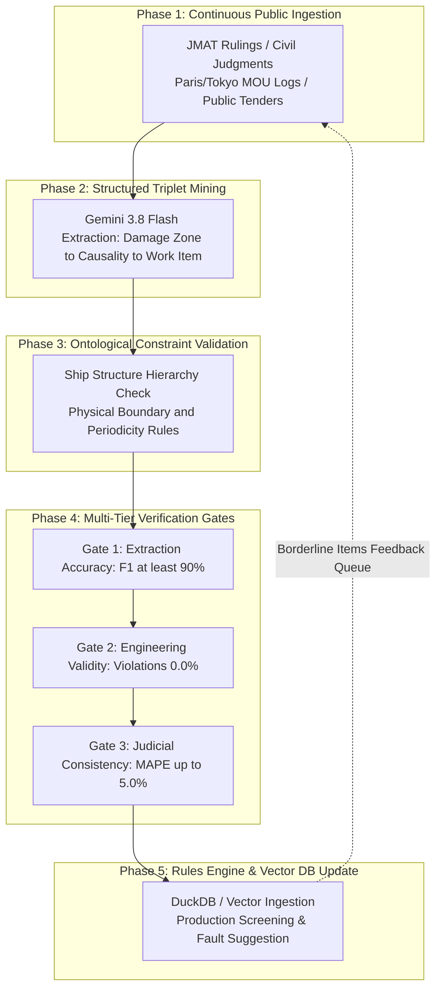

# Maritime Claims AI: Iterative Knowledge Loop Specification

## 1. Overview and Core Philosophy

This specification defines the standard operating procedure for the continuous, iterative improvement of the maritime claims rules engine and causal knowledge graph using public ground truth datasets (Japan Marine Accident Tribunal rulings, civil court precedents, public vessel drydock tenders, and Port State Control inspection logs).

The framework enforces three distinct dimensions of rigor: **Extraction Correctness**, **Engineering Soundness**, and **Practical/Business Validity**.

### Foundational Principles

- **No LLM Self-Grading**: LLM extraction outputs are never evaluated by LLMs. Instead, verification relies on three objective external criteria: human-annotated ground truth sets, naval architecture structural ontologies, and finalized judicial court damage awards.
- **Data-Driven & Decoupled Configuration**: Business rules, keyword dictionaries, and thresholds must never be hardcoded into evaluation scripts. They reside strictly in configuration files (`config/`) and database knowledge graphs.
- **Continuous Feedback Flywheel**: As new rulings, civil judgements, and repair specifications are ingested, benchmark metrics recompute automatically, allowing only validated knowledge to update production appraisal models.

---

## 2. Iterative Improvement Loop Overview

The continuous knowledge lifecycle comprises five sequential phases:



---

## 3. Phase Specifications and Quality Gates

### Phase 1: Public Information Ingestion & Caching

Idempotently downloads missing public datasets to the local repository, skipping existing verified files.

- **Pipeline Script**: [`scripts/fetch_public_datasets.py`](../scripts/fetch_public_datasets.py)
- **Primary Data Sources**:
  - MLIT Japan Marine Accident Tribunal (JMAT) Major Casualty Archives.
  - Tokyo and Osaka District Court Maritime Commercial Judgments (`courts.go.jp`).
  - Public vessel drydock repair specifications and official gazette contract awards (Fishery Agency, Coast Guard, Prefectural Patrol Fleets).
  - Paris MOU and Tokyo MOU Port State Control inspection and detention logs.
- **Output**: Local raw datasets stored in `_inputs/poc_datasets/`.

---

### Phase 2: Structured Triplet Mining (Information Extraction)

Extracts minimal atomic causal knowledge triplets from unstructured incident narratives and repair specifications.

- **Model Layer**: Gemini 3.8 Flash enforced by strict Pydantic/JSON schemas.
- **Triplet Schema**:
  - **Subject**: Damage zone / casualty description (e.g., `Bulbous bow hull breach`, `Starboard plating abrasion`, `Engine room flooding`).
  - **Predicate**: Causal classification (`Direct Causality (Covered)`, `Concurrent Repair (Excluded)`, `Common Charge (50% Apportionment)`, `Wear & Tear (Excluded)`).
  - **Object**: Repair package / trade discipline (e.g., `Hull shell insert replacement (HULL-03)`, `Main engine piston overhaul (ENG-01)`).
- **Source Citation**: Every extracted triplet must map to an exact coordinate or text snippet in the source document.

---

### Phase 3: Ontological Constraint Validation (Engineering Soundness)

Mechanically verifies that extracted causal triplets conform to physical naval architecture constraints before graph assembly.

- **Ship Structural Hierarchy Ontology**:
  - `Hull Compartment`: Bulbous bow, bottom plating, side shell, stern frame, transverse bulkheads.
  - `Deck & Superstructure`: Bridge, accommodation, cargo gear, mooring winches.
  - `Machinery Space`: Main engines, auxiliary generators, boilers, sea chest valves, pumps.
  - `Propulsion & Steering`: Propeller, shafting, stern tube, rudder blade, steering gear.
- **Constraint Rules**:
  - **Rule A (Physical Barrier Isolation)**: Impact damage on the forward bulbous bow cannot have a direct physical causality link to internal engine pistons across watertight bulkheads. Any such edge is immediately rejected.
  - **Rule B (Statutory Periodicity Restriction)**: Routine overhauls, mega-tester checks, and instrument calibrations are statutory periodic survey items. They are disallowed as casualty repairs unless direct external physical shock is substantiated.
- **Quality Gate**: **Ontology Constraint Violation Rate = 0.0%** (zero tolerance for physically impossible edges).

---

### Phase 4: Multi-Tier Verification Gates

Before deploying updated knowledge to production, the pipeline must pass three independent quantitative quality gates:

| Verification Tier | Focus Area | Methodology | Target KPI |
| :--- | :--- | :--- | :--- |
| **Tier 1: Extraction Correctness** | Triplet mining precision and recall | Evaluated against 100 human-annotated ground truth pairs | **F1-Score >= 90.0%**<br>(Precision >= 92%, Recall >= 88%) |
| **Tier 2: Engineering Soundness** | Structural integrity of causal graph | Automated validation against Ship Structural Hierarchy constraints | **Violation Rate = 0.0%**<br>(Zero invalid cross-compartment edges) |
| **Tier 3: Practical & Legal Validity** | End-to-end adjustment monetary accuracy | Benchmarked against civil court approved damage amounts | **MAPE <= 5.0%**<br>(Fault Attribution Accuracy >= 80.0%) |

#### Independent Marine Surveyor Blind Audit

- 50 claim line items (Approved / Disallowed Concurrent Repair / 50% Apportionment) are presented blindly to two licensed marine surveyors.
- Inter-rater agreement between the automated model and the surveyors is measured using Cohen's Kappa.
- **Quality Gate**: **Cohen's Kappa (κ) >= 0.85** (representing almost perfect agreement).

---

### Phase 5: Knowledge Integration & Feedback Flywheel

Validated knowledge is merged into the local hybrid database and production configuration layers.

- **Storage Destinations**:
  - **Relational Store (DuckDB / PostgreSQL)**: Verified trade packages, contract price baselines, court metadata.
  - **Vector Store (FastEmbed / `multilingual-e5-small`)**: Dense embeddings of damage descriptions, red-flag routine work items, and judicial reasoning.
  - **Configuration Layer ([`config/benchmark_rules.json`](../config/benchmark_rules.json))**: Triage thresholds and trade discipline classification codes.
- **Automated Feedback Loop**:
  - The claims engine automatically flags borderline repair items (similarity 0.45 to 0.55) to a triage queue.
  - The next ingestion cycle prioritizes gathering similar public vessel specifications to resolve edge-case ambiguities.

---

## 4. Enterprise Value Flywheel for Insurers

Executing this continuous improvement cycle establishes an unassailable data moat:

```text
[Public Data Baseline Model]
   │
   ▼
[Insurer Commercial Pilot] (Demonstrate 80-97% accuracy on public ground truth)
   │
   ▼
[Private Claims Ingestion] (Ingest 10 years of insurer closed claim files locally)
   │
   ▼
[Exponential Graph Enrichment] (Incorporate proprietary adjuster negotiation precedents)
   │
   ▼
[High Switching-Cost Enterprise Moat] (Customized virtual surveyor that cannot be replicated)
```

---

## 5. Operations Checklist

To run an iteration of the benchmark pipeline, execute:

```bash
# 1. Fetch missing public datasets (idempotent cache)
python3 scripts/fetch_public_datasets.py

# 2. Run multi-field scientific benchmark evaluation
python3 scripts/verify_3fields_benchmarks.py --config config/benchmark_rules.json

# 3. Execute claims screening prototype on casualty and repair specs
python3 scripts/prototype_experiment.py \
  --spec _inputs/poc_datasets/sample_drydock_repair_specification.pdf \
  --casualty _inputs/poc_datasets/jtsb_cargo_collision_report.pdf
```
