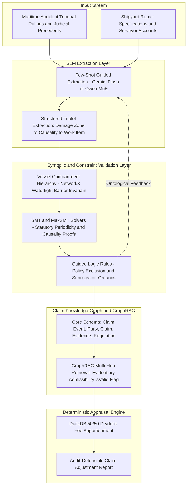
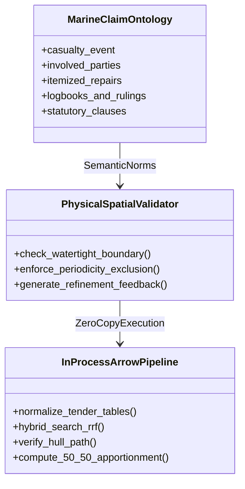

# Prior Literature Review & Architectural Foundations for MarineClaims AI

This document provides a systematic synthesis of the foundational research literature informing the architecture and continuous learning lifecycle of **MarineClaims AI** (an autonomous maritime casualty damage appraisal, hull insurance claim assessment, and recovery subrogation system).

---

## 1. Executive Summary & Research Landscape

Maritime casualty claims and hull insurance adjustments represent a high-stakes domain situated at the complex intersection of:
1. **Unstructured Domain Narrative**: Maritime tribunal casualty decisions (e.g., Japan Marine Accident Tribunal rulings), civil court precedents, and drydock repair tender specifications.
2. **Naval Architecture & Physical Constraints**: Watertight boundaries, ship compartment hierarchies, and physical propagation barriers.
3. **Statutory & Insurance Logic**: Hull & Machinery (H&M) policy terms (e.g., Institute Time Clauses - Hulls), P&I rules, statutory survey periodicity, and deterministic 50/50 drydock expense apportionment rules.

Off-the-shelf, general-purpose Large Language Models (LLMs) applied in a zero-shot or unconstrained setting suffer from pervasive hallucinations, statutory misattributions, and physical impossibility errors (e.g., attributing main engine piston damage to bow collision shock across intact watertight bulkheads).

To overcome these barriers, MarineClaims AI builds upon five key pillars established in recent legal and engineering AI literature:
- **Neuro-Symbolic Reasoning**: Bridging neural language fluency with logic programming (Prolog / Description Logic / SMT).
- **Physical & Spatial Ontological Validation**: Mechanical filtering of impossible causal propagation using structural graph traversal.
- **MaxSMT Solvers for Compliance & Optimization**: Computing minimal factual modifications and provably sound regulatory compliance.
- **Small Language Model (SLM) & MoE Optimization**: Harnessing sub-10B parameter Mixture-of-Experts architectures with few-shot prompting to match or exceed frontier models.
- **Domain Knowledge Graphs & GraphRAG**: Multi-hop entity-relationship traversals over claim events, evidentiary validity, and statutory bases.

---

## 2. In-Depth Analysis of Foundational Literature

### Paper 1: Towards Robust Legal Reasoning: Harnessing Logical LLMs in Law
- **Authors**: Manuj Kant, Sareh Nabi, Manav Kant, Roland Scharrer, Megan Ma, Marzieh Nabi
- **Affiliation**: Stanford CodeX, Amazon, Caltech, PaxAI
- **Citation**: arXiv:2502.17638 (2025)

#### Paper 1: Core Problem & Methodology
This study evaluates whether advanced frontier reasoning models (OpenAI o1, DeepSeek-R1, GPT-4o, Claude 3.5 Sonnet, Gemini 1.5 Pro) can accurately assess coverage disputes in insurance policies (Chubb Hospital Cash Benefit and Aetna Student Health Insurance). It compares three approaches:
1. **Vanilla LLM**: Direct zero-shot question-answering.
2. **Unguided Neuro-Symbolic**: Unconstrained translation of contracts and claims into Prolog logic.
3. **Guided Neuro-Symbolic**: Providing an explicit structured schema and domain framework for the LLM to extract facts and rules into Prolog, evaluated via a logic interpreter (SWI-Prolog).

#### Paper 1: Key Findings
- **Vanilla LLM Failure on Exclusion Boundaries**: Even state-of-the-art models plateaued at 78%–88% accuracy across 10 trials. All models consistently failed on boundary conditions involving policy exclusions—specifically failing to differentiate between status vs. activity (e.g., an off-duty police officer injured by family conduct vs. injury arising from police duty) and intentional acts vs. accidental injuries.
- **Superiority of Guided Logic**: Enforcing domain schema guidance during logic encoding achieved 100% auditable traceability and eliminated ungrounded interpretations.

#### Paper 1: Application to MarineClaims AI
- Policy exclusions in Marine Hull Insurance (such as statutory unseaworthiness, intentional misconduct, and concurrent owner repairs) require formal predicate logic representation rather than raw conversational prompting.
- Extraction routines must be enforced through strict schema-guided parsers (e.g., Pydantic structures mapping directly to insurance predicates).

---

### Paper 2: Enhancing Large Language Models through Neuro-Symbolic Integration and Ontological Reasoning
- **Authors**: Ruslan Idelfonso Magaña Vsevolodovna, Marco Monti
- **Affiliation**: IBM Client Innovation Center Italy, Free University of Bozen-Bolzano (UNIBZ)
- **Citation**: arXiv:2504.07640 (2025)

#### Paper 2: Core Problem & Methodology
Addressing the inherent tendency of LLMs to generate hallucinated or logically inconsistent relationships, this work develops a closed-loop neuro-symbolic refinement pipeline using Description Logic:
1. **NL-to-Logic Mapper**: Maps natural language assertions into formal Description Logic axioms `φ(a)` using an interpretable supervised classification framework.
2. **Symbolic Consistency Checking**: Evaluates consistency against an OWL 2 DL domain ontology using the HermiT hypertableau reasoner (`KB ∪ {φ(a)} ⊨ ⊥`).
3. **Iterative Refinement Loop**: When inconsistency is detected, the reasoner extracts minimal conflicting axioms (`inc`), which are converted into targeted corrective prompts `p' = makeprompt((p, a), inc)` sent back to the LLM for revision.

#### Paper 2: Key Findings
- The automated feedback loop systematically resolved domain constraint violations (e.g., misattributing failure modes between disparate engine component categories) that standard prompting failed to correct.

#### Paper 2: Application to MarineClaims AI
- Provides the formal foundation for **Phase 3 (Ontological Constraint Validation)** of the MarineClaims AI pipeline.
- When an extracted causal triplet links damage across distinct vessel compartments (e.g., bulbous bow impact causing main engine crankshaft misalignment), the system detects a spatial ontology contradiction and triggers a targeted refinement loop with an explicit physical impossibility report.

---

### Paper 3: Neuro-Symbolic Compliance: Integrating LLMs and SMT Solvers for Automated Financial Legal Analysis
- **Authors**: Yung-Shen Hsia, Fang Yu, Jie-Hong Roland Jiang
- **Affiliation**: National ChengChi University, National Taiwan University
- **Citation**: arXiv:2601.06181 (2026)

#### Paper 3: Core Problem & Methodology
Investigates regulatory compliance and automated legal analysis using 87 real-world enforcement cases from Taiwan's Financial Supervisory Commission (FSC). The authors propose:
1. **Hybrid Retrieval**: Combining BM25 and dense vector search (weight α = 0.8) with Cross-Encoder (FlagReranker) re-ranking.
2. **SMT Constraint Formulation**: Translating statutory clauses into Boolean and arithmetic constraints (Hard Constraints) and case facts into soft constraints.
3. **MaxSMT Optimization**: Using SMT solvers (Z3) to enforce consistency, achieve a >100× efficiency gain over iterative LLM debate, and compute the *minimal factual modification* required to restore legality when violations occur.

#### Paper 3: Key Findings
- Attained 86.2% correctness in automated SMT constraint synthesis.
- Replaced subjective post-hoc explanations with mathematically verifiable legal proofs and actionable, minimal-impact remediation paths.

#### Paper 3: Application to MarineClaims AI
- Directly informs the segregation between **Statutory Periodicity / Wear & Tear** (Hard Constraints) and **Casualty Impact Items** (Soft Constraints).
- Enables automated calculation of minimal adjustments required in shipyard invoices to eliminate unjustified claims leakage while maintaining compliance with class society rules and court precedents.

---

### Paper 4: Can Small Models Reason About Legal Documents? A Comparative Study
- **Authors**: Snehit Vaddi
- **Affiliation**: Independent Researcher
- **Citation**: arXiv:2603.25944 (2026)

#### Paper 4: Core Problem & Methodology
Evaluates whether sub-10B parameter open-weight models can replace costly, privacy-sensitive frontier API models in production legal workflows. Across 405 controlled experiments covering three benchmarks (ContractNLI, CaseHOLD, ECtHR), nine models (3B to 9B dense and MoE architectures, alongside GPT-4o-mini and Claude 3.5 Haiku) were evaluated under five prompting strategies (Direct, Chain-of-Thought, Few-Shot, BM25 RAG, Dense RAG).

#### Paper 4: Key Findings
1. **MoE Architectural Efficiency**: Qwen3-A3B (activating only 3B parameters out of 30B total) matched GPT-4o-mini in overall accuracy (46.5% vs. 47.2%) and outperformed it on legal holding identification under few-shot prompting (71.2% vs. 67.9%).
2. **Parameter Count vs. Architecture**: Nemotron-9B performed the worst among all models (17.7%), demonstrating that model architecture and pre-training data quality outweigh raw parameter scaling.
3. **Task-Dependent CoT Dynamics**: While Chain-of-Thought improved ContractNLI (+8.5 pp), it severely degraded CaseHOLD multiple-choice reasoning (-16.0 pp) and multi-label classification. In contrast, **Few-Shot prompting was universally the most effective strategy**.
4. **Retrieval Equivalence**: BM25 (sparse) and dense embeddings performed virtually identically, showing that downstream reasoning over retrieved context is the primary bottleneck rather than retriever type.

#### Paper 4: Application to MarineClaims AI
- Validates the selection of efficient models (Gemini Flash or local 3B–8B MoE SLMs) operating in an in-process, few-shot configuration for Phase 2 triplet extraction.
- Demonstrates that expensive GPU infrastructure and frontier APIs are unnecessary for structured legal-technical extraction when accompanied by domain-specific few-shot examples and schema constraints.

---

### Paper 5: Claim Knowledge Graph Construction and GraphRAG-Based Question-Answering System
- **Authors**: Xinxue Wang, Jun Fang
- **Affiliation**: Wuhan University of Technology (School of Civil Engineering and Architecture)
- **Citation**: Buildings 2026, 16, 845

#### Paper 5: Core Problem & Methodology
Addresses the limitations of manual claim review and standard Vector RAG in construction disputes. The authors develop:
1. **Domain Claim Ontology**: Constructed via a 5-step methodology, defining five universal top-level classes:
   - `Claim Event` (deviations in schedule, site conditions, scope changes)
   - `Party` (claimant, respondent)
   - `Claim` (cost items, time extensions)
   - `Evidence Material` (site logs, photos, meeting minutes; crucially tracking `isValid` and `reasonForInvalid`)
   - `Contract/Law/Regulation` (statutory clauses, standard contract models)
2. **GraphRAG Architecture**: Populates a Neo4j knowledge graph from contracts and 44 legal and arbitral cases, retrieving multi-hop subgraphs to ground LLM question-answering.

#### Paper 5: Key Findings
- GraphRAG significantly outperformed both base LLMs and naive Vector RAG across BLEU-4, ROUGE-1, ROUGE-L, and BERT-Cosine similarity metrics.
- Vector similarity alone frequently failed to determine causal entitlement and evidentiary admissibility, whereas relational graph traversal accurately enforced evidence validity rules.

#### Paper 5: Application to MarineClaims AI
- The 5-class ontology maps directly to maritime casualty claims:
  - `Claim Event` → Grounding, Collision, Heavy Weather, Machinery Breakdown.
  - `Party` → Shipowner, Charterer, P&I Club, Hull Underwriter, Classification Society.
  - `Claim` → Steel renewal, drydock dues, propeller reconditioning, salvage fees.
  - `Evidence Material` → Official deck/engine logbooks, JMAT tribunal rulings, surveyor reports (with strict `isValid` flags).
  - `Contract/Law/Regulation` → Maritime Commercial Code, COLREGS, York-Antwerp Rules, ITC-Hulls.

---

## 3. Cross-Comparative Synthesis Matrix

| Dimension | Kant et al. (Stanford CodeX) | Magaña & Monti (IBM / UNIBZ) | Hsia et al. (NCCU / NTU) | Vaddi (Comparative Study) | Wang & Fang (Buildings 2026) |
| :--- | :--- | :--- | :--- | :--- | :--- |
| **Domain** | Health & accident insurance contracts | Engine components & failure modes | Financial & insurance regulatory compliance | Legal benchmarks (contracts, holdings, human rights) | Construction & engineering claims |
| **Symbolic Verification** | Prolog Horn clauses (SWI-Prolog) | OWL 2 DL + HermiT reasoner | SMT Solver (Z3) / MaxSMT | None (Prompt & model evaluation) | Neo4j graph traversal & ontology constraints |
| **LLM Role** | Contract/claim to logic translation | Candidate answer generation & semantic parsing | Statutory interpretation & SMT constraint synthesis | Primary extractor & reasoner | Triplet extraction & graph-grounded generation |
| **Inconsistency Resolution** | Pre-factored guided logic schema | Closed-loop iterative refinement with conflict explanations | Minimal factual modification via MaxSMT optimization | Prompt optimization (Few-shot over CoT) | Evidentiary admissibility (`isValid`, `reasonForInvalid`) |
| **Retrieval Strategy** | In-context / Direct | Closed-world domain axioms | Hybrid (BM25 + Vector + Cross-Encoder) | BM25 vs Dense (confirmed equivalent utility) | GraphRAG (subgraph injection) |
| **MarineClaims AI Integration** | Policy exclusion logic (Phase 4) | Watertight boundary loop (Phase 3) | Periodic inspection & 50/50 fee solving (Phase 5) | Triplet mining engine & few-shot prompts (Phase 2) | Claims ontology & evidence validation (Phase 1 & 5) |

---

## 4. Architectural Implementation in MarineClaims AI

The theoretical insights from these five studies are directly materialized in the MarineClaims AI technical architecture:

### 1. High-Efficiency Triplet Extraction (Phase 2)
- **Model Configuration**: Fast SLM / Gemini Flash guided by strict Pydantic schemas.
- **Prompt Strategy**: In line with Vaddi (2026), unconstrained Chain-of-Thought is replaced by **exemplar-driven Few-Shot prompting**, eliminating verbose drift and ensuring predictable JSON serialization of `[Damage Zone] - [Causality] - [Work Item]` triplets.

### 2. Physical & Spatial Boundary Invariants (Phase 3)
- **Engine**: In-process directed graph using NetworkX.
- **Invariant Enforcement**: Following Magaña & Monti (2025) and Wang & Fang (2026), the vessel's physical arrangement is represented as a connectivity graph. If a causal edge violates watertight bulkheads, an ontological inconsistency explanation is generated, triggering an automated refinement loop back to the extractor.

### 3. Regulatory Exclusion & Apportionment Optimization (Phases 4 & 5)
- **Engine**: DuckDB analytical SQL coupled with constraint-solving rules.
- **Execution**: Drawing from Hsia et al. (2026) and Kant et al. (2025), statutory survey items (e.g., standard propeller clearance measurements, megger testing) are treated as hard non-casualty exclusions. Common drydock expenses are deterministically apportioned (50/50) between owner maintenance and casualty work without generative hallucination.

### 4. Evidentiary Admissibility & Multi-Hop Auditability
- **Engine**: LanceDB hybrid search (BM25 + vector with Reciprocal Rank Fusion) and structured tabular knowledge graphs.
- **Execution**: Adopting Wang & Fang's evidentiary validation schema, all supporting records (e.g., official JMAT findings, surveyor logs) maintain verifiable audit trails with explicit admissibility flags, ensuring all appraisal adjustments are defendable against litigation or arbitration scrutiny.
