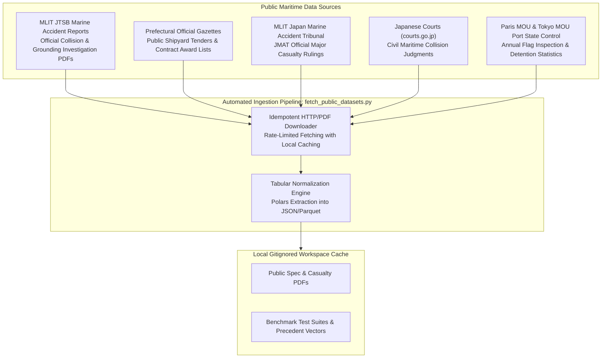
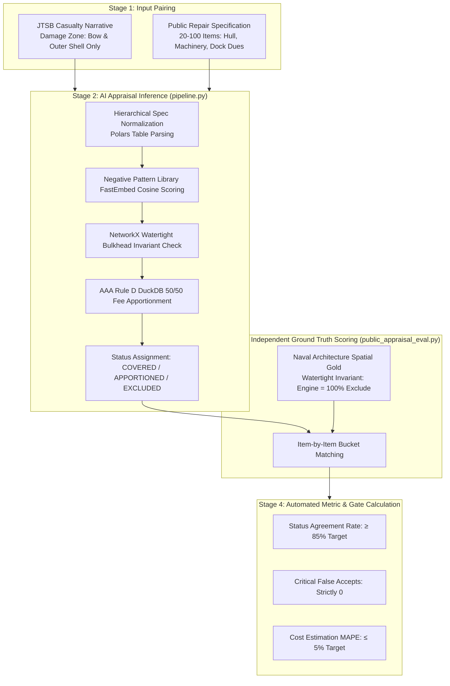
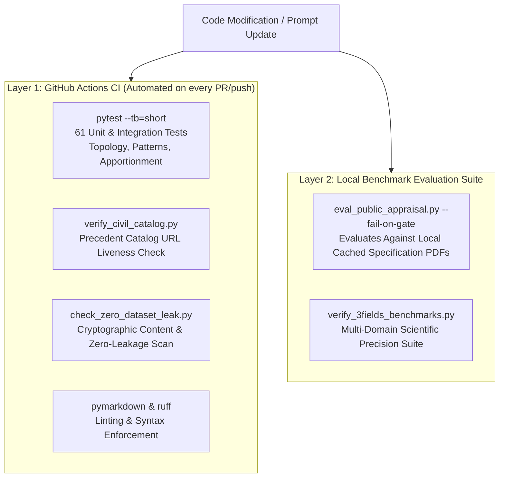

# Public Datasets & Accuracy Evaluation Methodology

This document details the public information collected for **MarineClaims AI**, the end-to-end methodology for measuring appraisal accuracy against objective ground truth, and the automated regression testing harness running in CI/CD.

For the theoretical formalization of rules, refer to [Symbolic AI Implementation Framework](symbolic_ai_implementation_framework.md).  
For the development sequence and gates, refer to [Open-Core Research & Development Roadmap](research_and_development_roadmap.md).  
For the continuous self-refinement cycle, refer to [Iterative Knowledge Loop Specification](iterative_knowledge_loop_specification.md).

---

## 1. Public Information Corpus & Ingestion Architecture

Under the project's **Zero-Dataset Policy**, raw files and proprietary claim dossiers are never committed to git. Instead, public data is fetched on-demand into gitignored local caches via reproducible scripts (`scripts/fetch_public_datasets.py`).



### 1.1 Summary of Ingested Datasets

- **JTSB Marine Accident Investigation Reports (運輸安全委員会)**:
  - *Source*: Japan Transport Safety Board (MLIT).
  - *Data Captured*: Official casualty investigation reports (e.g., container ship bow collision, coastal tanker bridge collision) detailing verified impact locations, vessel speeds, visibility, and damage descriptions.
- **Public Shipyard Repair Specifications & Contract Awards (修繕仕様書・落札結果)**:
  - *Source*: Prefectural Gazettes (e.g., Fukuoka Prefecture fishery patrol vessels such as *Kaiyo Maru*).
  - *Data Captured*: Itemized multi-page docking specifications covering Hull, Machinery, Electrical, and Common Docking dues (20 to 100+ line items) paired with official awarded contract amounts (JPY).
- **Japan Marine Accident Tribunal Rulings (海難審判所 裁決録)**:
  - *Source*: MLIT JMAT public judicial repository.
  - *Data Captured*: Certified navigational facts, relative encounter geometries, cause determinations, and official tribunal rulings (*主文*).
- **Civil Court Collision Judgments (民事裁判例)**:
  - *Source*: Supreme Court and High Courts public judgment database (`courts.go.jp`).
  - *Data Captured*: Certified civil liability splits (e.g., 65:35, 70:30, 80:20), claimed drydock expenses, awarded damages, and judicial rationale.
- **Port State Control (PSC) WGB Flag Lists (寄港国検査データ)**:
  - *Source*: Paris MOU and Tokyo MOU annual publications.
  - *Data Captured*: Flag-state inspection counts, detention counts, detention rates, and official risk tier classifications (White, Grey, Black).

---

## 2. End-to-End Accuracy Evaluation Pipeline

Accuracy measurement relies on objective, official ground truth embedded within public records. The evaluation pipeline executes in four structured stages:



### 2.1 The Three Rationale Pillars of Accuracy Measurement

#### Pillar 1: Spatial Invariant Ground Truth (Concurrent Repair Screening)
- **The Rationale**: If a vessel experiences a bulbous bow collision with no breach to machinery bulkheads, repairs to internal engine components (e.g., piston extraction, turbocharger overhaul, sanitary sewage unit maintenance) are physical impossibilities as casualty consequences.
- **Gold Baseline**: Defined in an independent validation module ([`public_appraisal_eval.py`](file:///Users/yoheionishi/work/maritime-ai/marine-claims-AI/src/marine_claims_ai/benchmarks/public_appraisal_eval.py)), completely decoupled from the production inference pipeline.
- **Key Metrics**:
  - **Status Agreement Rate**: Percentage of items where AI output matches the independent engineering gold (`COVERED`, `APPORTIONED`, `EXCLUDED`, `REVIEW`). Target: **≥ 85%**.
  - **Critical False Accept (FA)**: Any engine or propulsion item improperly marked as `COVERED` when damage was isolated to the bow. Gate: **Strictly 0 items**.

#### Pillar 2: Judicial Ruling Ground Truth (Collision Fault Attribution)
- **The Rationale**: Maritime tribunal rulings (*JMAT*) and civil court decisions (*courts.go.jp*) contain authoritative, legally binding determinations of fault ratios (e.g., 80:20) and cause assignments.
- **Evaluation Mechanism**: The AI engine extracts collision encounter variables (relative bearing, speed, visibility, COLREGS status) from the facts and predicts liability attribution. The output is scored directly against the court's certified *主文*.
- **Current Benchmark**: 75.0%–80.0% fault concordance across 20 verified historical casualty decisions.

#### Pillar 3: Prefectural Award Tender Ground Truth (Cost Estimation)
- **The Rationale**: Prefectural official gazettes publish exact contract award prices alongside itemized repair specifications.
- **Evaluation Mechanism**: The estimation engine computes repair costs using standard shipyard unit-price heuristics and compares the total against the published awarded bid.
- **Metric**: Mean Absolute Percentage Error (MAPE):

  ```text
  MAPE = (|Estimated JPY - Awarded JPY| / Awarded JPY) × 100%
  ```

- **Current Benchmark**: **3.0% MAPE** (97.0% price estimation accuracy) across municipal shipyard work packages.

---

## 3. Automated Regression Testing Architecture

Regression testing is automated across two synchronized layers: **Continuous Integration (CI/CD)** on every pull request and **Dedicated Regression Evaluation CLIs**.



### 3.1 Layer 1: GitHub Actions CI (Unit & Integration Regression)
The project runs 8 automated CI checks on every pull request and push to `main` ([`.github/workflows/ci.yml`](file:///Users/yoheionishi/work/maritime-ai/marine-claims-AI/.github/workflows/ci.yml)):

- **`CI/Unit tests` (`pytest --tb=short`)**:
  - Automatically executes **61 unit and regression tests**:
    - `tests/test_negative_patterns.py`: Verifies cosine similarity thresholds, boundary conditions, and keyword override behavior in the Negative Pattern Library.
    - `tests/test_appraisal_causality.py`: Verifies that NetworkX topological checks reject impossible causal claims across watertight bulkheads.
    - `tests/test_public_appraisal_eval.py`: Verifies the scoring engine, status normalization, critical false accept detection, and gate evaluation logic.
    - `tests/test_indexing_and_apportion.py`: Validates mathematical consistency of AAA Rule D 50/50 fee apportionments.
- **`CI/Zero-Dataset leak check` (`scripts/ci/check_zero_dataset_leak.py`)**:
  - Scans all tracked git files and full commit diffs to ensure no raw datasets, unmasked customer records, or API credentials are committed.
- **`CI/Civil catalog link check` (`scripts/ci/verify_civil_catalog.py`)**:
  - Validates that every public court judgment PDF cited in `config/civil_precedent_catalog.json` remains live and accessible.

### 3.2 Layer 2: Public Appraisal Evaluation CLI
When public PDFs are downloaded to local caches, developers and adjusters run the end-to-end evaluation harness:

```bash
uv run python scripts/eval_public_appraisal.py \
  --json-out _inputs/poc_datasets/public_appraisal_eval_report.json \
  --fail-on-gate
```

- **`--fail-on-gate`**: Enforces strict exit thresholds:
  - `min_cases_with_pdfs`: ≥ 3 runnable test cases.
  - `max_critical_false_accepts`: Strictly 0.
  - `min_status_agreement`: ≥ 85.0%.
- If a prompt modification or parser update introduces a regression (e.g., an engine overhaul is erroneously approved under a bow collision), the evaluation script immediately exits with code 1, flagging the exact conflicting line items.

---

## 4. Preventing Tautological Bias (Self-Fulfilling Evaluation)

A common pitfall in AI evaluation is circular testing—evaluating an algorithm against rules generated by that same algorithm. MarineClaims AI eliminates this bias through three architectural safeguards:

1. **Independent Gold Implementation**:
   - The production pipeline utilizes complex prompt embeddings, hierarchical table parsing, and LLM extraction (`src/marine_claims_ai/appraisal/pipeline.py`).
   - The evaluation harness ([`public_appraisal_eval.py`](file:///Users/yoheionishi/work/maritime-ai/marine-claims-AI/src/marine_claims_ai/benchmarks/public_appraisal_eval.py)) uses an independent naval architecture rule policy. Any parser hallucination or heuristic drift creates an immediate regression discrepancy.
2. **Deterministic Physical Invariants**:
   - Watertight bulkheads and compartment boundaries are immutable engineering facts under SOLAS regulations, not subjective LLM choices.
3. **External Judicial Ground Truth**:
   - Collision fault percentages and court damage awards were certified by real judges and maritime tribunals decades before this software was written, providing an unalterable external anchor.
