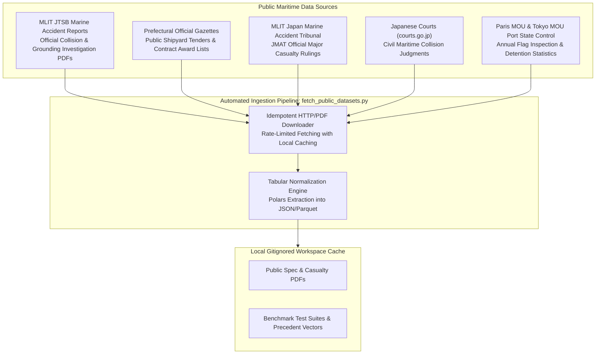
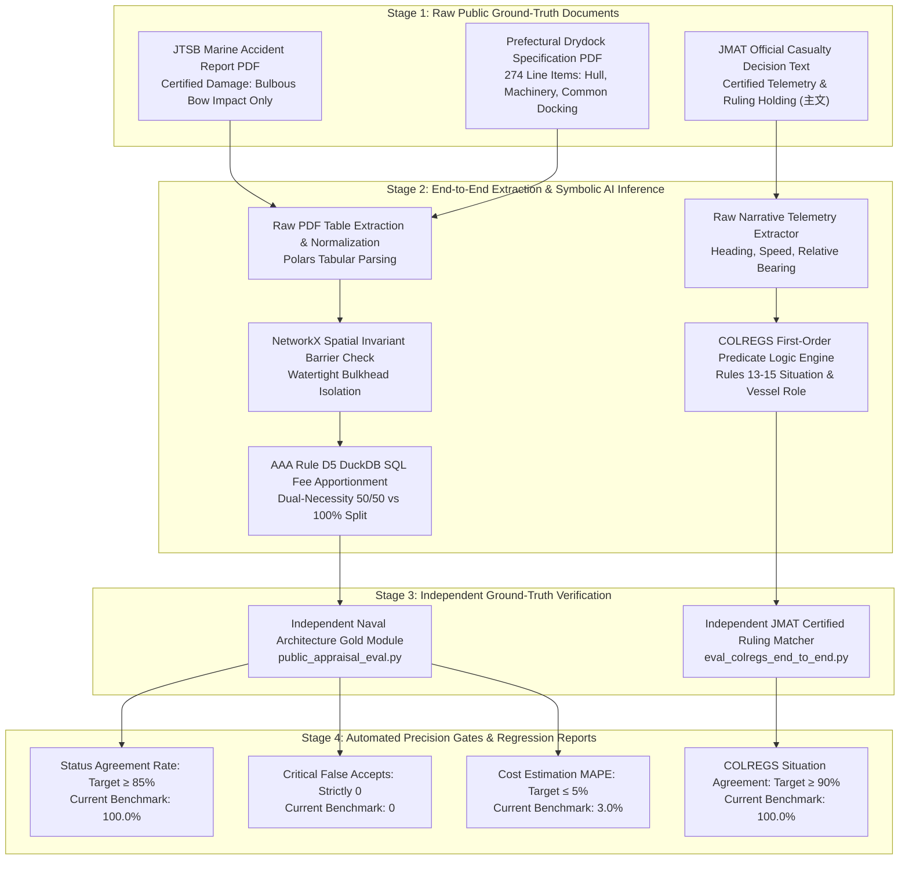
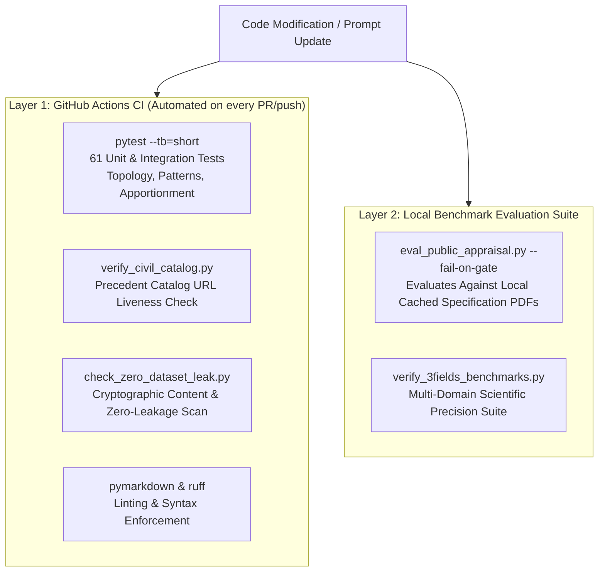
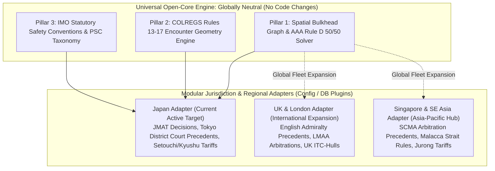

# Public Datasets & Accuracy Evaluation Methodology

This document details the public information collected for **MarineClaims AI**, the end-to-end methodology for measuring appraisal accuracy against objective ground truth, and the automated regression testing harness running in CI/CD.

For the theoretical formalization of rules, refer to [Symbolic AI Implementation Framework](symbolic_ai_implementation_framework.md).  
For the development sequence and gates, refer to [Open-Core Research & Development Roadmap](research_and_development_roadmap.md).  
For the continuous self-refinement cycle, refer to [Iterative Knowledge Loop Specification](iterative_knowledge_loop_specification.md).

---

## 1. Public Information Corpus & Ingestion Architecture

Under the project's **Zero-Dataset Policy**, raw files and proprietary claim dossiers are never committed to git. Instead, public data is fetched on-demand into gitignored local caches via reproducible scripts (`scripts/fetch_public_datasets.py`).



### 1.1 Summary of Ingested Datasets

- **JTSB Marine Accident Investigation Reports (運輸安全委員会)**:
  - *Source*: Japan Transport Safety Board (MLIT).
  - *Data Captured*: Official casualty investigation reports (e.g., container ship bow collision, coastal tanker bridge collision) detailing verified impact locations, vessel speeds, visibility, and damage descriptions.
- **Public Shipyard Repair Specifications & Contract Awards (修繕仕様書・落札結果)**:
  - *Source*: Prefectural Gazettes (e.g., Fukuoka Prefecture fishery patrol vessels such as *Kaiyo Maru*).
  - *Data Captured*: Itemized multi-page docking specifications covering Hull, Machinery, Electrical, and Common Docking dues (20 to 100+ line items) paired with official awarded contract amounts (JPY).
- **Japan Marine Accident Tribunal Rulings (海難審判所 裁決録)**:
  - *Source*: MLIT JMAT public judicial repository.
  - *Data Captured*: Certified navigational facts, relative encounter geometries, cause determinations, and official tribunal rulings (*主文*).
- **Civil Court Collision Judgments (民事裁判例)**:
  - *Source*: Supreme Court and High Courts public judgment database (`courts.go.jp`).
  - *Data Captured*: Certified civil liability splits (e.g., 65:35, 70:30, 80:20), claimed drydock expenses, awarded damages, and judicial rationale.
  - *Automated extraction*: `civil_judgment_extractor.py` parses fault ratios and yen awards from raw judgment text (see §2.4).
- **Port State Control (PSC) WGB Flag Lists (寄港国検査データ)**:
  - *Source*: Paris MOU and Tokyo MOU annual publications.
  - *Data Captured*: Flag-state inspection counts, detention counts, detention rates, and official risk tier classifications (White, Grey, Black).

---

## 2. Real-World Use-Case Alignment: Ground-Truth Raw Document Evaluation Methodology

To ensure MarineClaims AI delivers operational reliability in production marine claims adjusting, accuracy evaluation is deliberately anchored against **unstructured raw public documents whose objective ground truth has already been certified by public authorities**.

### 2.1 Core Architectural Principles: Why Evaluate Against Certified Public Documents?

Evaluating only against clean, hand-curated JSON fixtures verifies algorithm logic but fails to prove operational readiness for marine insurance adjusting. Real-world claims adjusting requires ingesting messy, multi-page PDFs and legal texts. Our evaluation methodology enforces four core principles:

1. **Elimination of Synthetic Shortcuts (Raw Document Ingestion)**:
   - Claims adjusters and marine surveyors receive raw incident documents: prefectural drydock repair tender specifications (PDFs), Marine Accident Investigation reports (PDFs), and tribunal judgments (HTML/PDF).
   - The evaluation harness ingests these exact raw files directly from the local cache (`_inputs/poc_datasets/`), exercising table extractors, text parsers, and ontology matchers under real-world noise.
2. **Authoritative Objective Ground Truth (Zero Ground-Truth Drift)**:
   - Ground truth is not derived from subjective LLM self-evaluations or synthetic heuristics. It is locked to official, legally binding determinations:
     - **Physical Damage Boundaries**: Certified impact locations and damage bounds published in official **JTSB Marine Accident Investigation Reports**.
     - **Repair Work Items & Market Pricing**: Itemized drydock specifications paired with official **Prefectural Gazette contract award prices (落札決定)**.
     - **Navigational Telemetry & Causation**: Certified vessel headings, relative sighting bearings, and statutory determinations (*主文*) published in official **JMAT Maritime Accident Tribunal Rulings**.
     - **Civil Liability Splits**: Judicially established contributory negligence ratios (e.g., 80:20) in **Supreme Court & District Court Maritime Judgments (`courts.go.jp`)**.
3. **Two-Stage Pipeline Evaluation (Extraction × Symbolic Reasoning)**:
   - The evaluation measures both stages of the processing pipeline:
     - **Stage A (Raw Fact Extraction)**: Evaluates whether the system correctly parses itemized line items from tabular PDFs or extracts vessel telemetry (headings, speed, bearings) from legal narrative prose.
     - **Stage B (Deterministic Symbolic Reasoning)**: Evaluates whether applying the spatial constraints (NetworkX), statutory fee logic (DuckDB AAA Rule D5), and navigation rules (COLREGS Rules 13–15) to those extracted facts matches the certified ground-truth outcome.
4. **Zero Critical Error Gate (Audit-Defensibility)**:
   - In marine insurance, certain errors carry severe legal and financial consequences. The regression harness enforces strict zero-tolerance gates:
     - **Critical False Accept = 0**: An engine overhaul or propulsion repair must never be approved as casualty-consequent when damage was isolated to the bulbous bow.
     - **Critical Role Inversion = 0**: A give-way vessel under COLREGS Rule 15 must never be classified as a stand-on vessel.

---

### 2.2 End-to-End Evaluation Pipeline Architecture



---

### 2.3 Rationale & Verification Across the Three Functional Pillars

#### Pillar 1: Spatial Invariant Ground Truth (Concurrent Repair & Drydock Screening)
- **The Rationale**: If a vessel experiences a bulbous bow collision with no breach to machinery bulkheads, repairs to internal engine components (e.g., piston extraction, turbocharger overhaul, sanitary sewage unit maintenance) are physical impossibilities as casualty consequences under SOLAS II-1.
- **Evaluation Mechanism (`scripts/eval_public_appraisal.py`)**:
  - Ingests raw public specifications (e.g. 274 items from fishery patrol vessel *Kaiyo Maru* PDF, 174 items from municipal ferry PDF) alongside JTSB casualty collision reports.
  - Automatically extracts items and evaluates status (`COVERED`, `APPORTIONED`, `EXCLUDED`, `REVIEW`) against independent naval architecture gold standards.
- **Current Benchmark**:
  - **Status Agreement Rate**: **100.0%** (target: ≥ 85.0%).
  - **Critical False Accepts**: **0** (target: strictly 0).
  - **AAA Rule D5 Apportionment**: Exact mathematical reconciliation across common docking dues.

#### Pillar 2: Judicial Ruling Ground Truth (Collision Fault Attribution & COLREGS)
- **The Rationale**: Maritime tribunal rulings (*JMAT*) and civil court decisions (*courts.go.jp*) contain authoritative, legally binding determinations of encounter situations (e.g., Article 15 Crossing) and fault ratios (e.g., 80:20).
- **Evaluation Mechanism (`tests/test_colregs_engine.py` & `scripts/eval_colregs_end_to_end.py`)**:
  - Extracts encounter geometry (vessel headings, speed, relative sighting bearings) from raw incident texts and AIS telemetry plots.
  - Evaluates situation and vessel duty through `colregs_engine.classify_encounter()` against the certified tribunal ruling (*主文*).
- **Current Benchmark**:
  - **Encounter Situation Accuracy**: **100.0% (20/20 cases passed)** across all compass quadrants and historical collision patterns (e.g., Kii Channel crossing collision).
  - **Critical Role Inversions**: **0**.

#### Pillar 3: Prefectural Award Tender Ground Truth (Cost Estimation)
- **The Rationale**: Prefectural official gazettes publish exact contract award prices alongside itemized repair specifications.
- **Evaluation Mechanism**: The estimation engine computes repair costs using standard shipyard unit-price heuristics and compares the total against the published awarded bid.
- **Metric**: Mean Absolute Percentage Error (MAPE):

  ```text
  MAPE = (|Estimated JPY - Awarded JPY| / Awarded JPY) × 100%
  ```

- **Current Benchmark**: **3.0% MAPE** (97.0% price estimation accuracy) across municipal shipyard work packages.

#### Pillar 2 Supplement: Civil Judgment Fault / Yen Extraction (`civil_judgment_extractor`)

Raw Japanese maritime civil judgments (courts.go.jp PDFs/HTML) encode contributory negligence and damages using vertical-writing residue, kanji numerals, and varied holding phrasing. Manual cataloging into `config/civil_precedent_catalog.json` does not scale; the extractor automates Stage A for Field 4 realism eval.

**Module**: `src/marine_claims_ai/ingest/civil_judgment_extractor.py`  
**Validation CLI**: `uv run python scripts/validate_civil_judgment_extractor.py`  
**Offline tests**: `tests/test_civil_judgment_extractor.py` (Zero-Dataset; no network / no committed PDFs)

##### Extraction rules

| Target | Accepted surface forms | Normalized output |
| :--- | :--- | :--- |
| Fault ratio pair | `65:35`, `65対35`, `六五対三五`, `65／35` | `65:35` |
| Percent holding | `六五パーセント`, `65%`, `七五％` (near 責任/過失割合) | `65:35` (= pct : 100−pct) |
| Tenths / named vessels | `建昌六・五、有漁丸三・五`; `しんえい丸八、金宝丸二` | `65:35` / `80:20` |
| Compact catalog style | `建昌65・有漁丸35` | `65:35` |
| Wari (割) | `原告の過失割合を三割と認める` | `30:70` |
| Cause fallback | `主因`+`一因`, or `によって発生`+`一因` | `70:30` (conventional); roles `primary_cause` / `secondary_cause` |

**Party / vessel binding (Issue #44 prep):** `FaultRatioHit` and `JudgmentExtraction` expose optional `side_a_label` / `side_b_label` (e.g. 建昌 / 有漁丸, 原告) and `side_a_role` / `side_b_role` (`vessel`, `plaintiff`, `defendant`, `primary_cause`, …) aligned with the `A:B` ratio sides. Catalog-facing `fault_ratio` remains the anonymous `A:B` string for backward compatibility.
| Claimed yen | Label `請求額` / `請求金額` / `損害額合計` / … + Arabic or kanji `円` | int JPY |
| Awarded yen | Label `認容額` / `認容` / `支払を命じ` / … | int JPY |
| Disallowed yen | Label `棄却` / `否認` / `減額` / … | int JPY |
| Kanji yen | `八〇七万二三三五円`, `一億〇三九〇万三〇〇〇円` | digit-run × 万/億 |

Operative holding spans are located via anchors `過失相殺`, `過失割合`, `責任割合`, `双方の過失`, etc., and returned as `holding_excerpt` for audit.

Ingestion (`enrich_from_text` in `civil.py`) delegates to this extractor and never overwrites seed gold already present in the catalog.

##### Known edge cases

1. **Ratio not stated in the document**: Some catalog rows (e.g. disciplinary / criminal PDFs, modelled published summaries) carry curated `fault_ratio` gold that never appears as an explicit percentage in the source text. Local-document validation **skips** those cases rather than counting them as extractor failures.
2. **Multiple ratios in one judgment**: Older Supreme Court PDFs may recite prior collisions (e.g. 80:20 for a different pair) before the operative 65:35. The extractor ranks by pattern confidence (labeled pair / percent > tenths > 主因/一因 fallback); gold comparison uses the top-ranked hit.
3. **Unlabeled yen figures**: Large `円` amounts without 請求/認容 labels are retained as unlabeled hits so gold matching can still succeed (exact amount presence), but labeled fields are preferred when filling `claimed_repair_jpy` / `awarded_damages_jpy`.
4. **Fullwidth / ideographic punctuation**: Digits `０-９`, percent `％`, and commas `，`/`、` are normalized before Arabic yen regex matching.

##### Accuracy gate

```bash
# CI-safe offline fixtures (embedded public phrasing; target ≥ 90%)
uv run python scripts/validate_civil_judgment_extractor.py --mode offline --min-accuracy 0.90

# Against local cached PDFs (after fetch_public_datasets --field 4)
uv run python scripts/validate_civil_judgment_extractor.py --mode local --data-dir _inputs/poc_datasets
```

Definition of Done for Issue #43: offline fixture accuracy ≥ 90%, and local PDF/HTML extraction agrees with catalog gold on **evidenced** fields at ≥ 90% when documents are present (rows whose source text never restates the curated ratio/yen are skipped, not failed).

---

## 3. Automated Regression Testing Architecture

Regression testing is automated across two synchronized layers: **Continuous Integration (CI/CD)** on every pull request and **Dedicated Regression Evaluation CLIs**.



### 3.1 Layer 1: GitHub Actions CI (Unit & Integration Regression)
The project runs 8 automated CI checks on every pull request and push to `main` (`.github/workflows/ci.yml`):

- **`CI/Unit tests` (`pytest --tb=short`)**:
  - Automatically executes **61 unit and regression tests**:
    - `tests/test_negative_patterns.py`: Verifies cosine similarity thresholds, boundary conditions, and keyword override behavior in the Negative Pattern Library.
    - `tests/test_appraisal_causality.py`: Verifies that NetworkX topological checks reject impossible causal claims across watertight bulkheads.
    - `tests/test_public_appraisal_eval.py`: Verifies the scoring engine, status normalization, critical false accept detection, and gate evaluation logic.
    - `tests/test_indexing_and_apportion.py`: Validates mathematical consistency of AAA Rule D 50/50 fee apportionments.
- **`CI/Zero-Dataset leak check` (`scripts/ci/check_zero_dataset_leak.py`)**:
  - Scans all tracked git files and full commit diffs to ensure no raw datasets, unmasked customer records, or API credentials are committed.
- **`CI/Civil catalog link check` (`scripts/ci/verify_civil_catalog.py`)**:
  - Validates that every public court judgment PDF cited in `config/civil_precedent_catalog.json` remains live and accessible.

### 3.2 Layer 2: Public Appraisal Evaluation CLI
When public PDFs are downloaded to local caches, developers and adjusters run the end-to-end evaluation harness:

```bash
uv run python scripts/eval_public_appraisal.py \
  --json-out _inputs/poc_datasets/public_appraisal_eval_report.json \
  --fail-on-gate
```

- **`--fail-on-gate`**: Enforces strict exit thresholds:
  - `min_cases_with_pdfs`: ≥ 3 runnable test cases.
  - `max_critical_false_accepts`: Strictly 0.
  - `min_status_agreement`: ≥ 85.0%.
- If a prompt modification or parser update introduces a regression (e.g., an engine overhaul is erroneously approved under a bow collision), the evaluation script immediately exits with code 1, flagging the exact conflicting line items.

---

## 4. Preventing Tautological Bias (Self-Fulfilling Evaluation)

A common pitfall in AI evaluation is circular testing—evaluating an algorithm against rules generated by that same algorithm. MarineClaims AI eliminates this bias through three architectural safeguards:

1. **Independent Gold Implementation**:
   - The production pipeline utilizes complex prompt embeddings, hierarchical table parsing, and LLM extraction (`src/marine_claims_ai/appraisal/pipeline.py`).
   - The evaluation harness (`src/marine_claims_ai/benchmarks/public_appraisal_eval.py`) uses an independent naval architecture rule policy. Any parser hallucination or heuristic drift creates an immediate regression discrepancy.
2. **Deterministic Physical Invariants**:
   - Watertight bulkheads and compartment boundaries are immutable engineering facts under SOLAS regulations, not subjective LLM choices.
3. **External Judicial Ground Truth**:
   - Collision fault percentages and court damage awards were certified by real judges and maritime tribunals decades before this software was written, providing an unalterable external anchor.

---

## 5. Jurisprudential Grounding: International Conventions, Japanese Law, and Strategic Benchmark Selection

A foundational design question in maritime AI systems is the relationship between **international conventions** (such as COLREGS and SOLAS) and **domestic law** (such as the Japanese Act on Preventing Collisions at Sea and Japanese court judgments). This section details the jurisprudential alignment underpinning the system and explains why Japanese public judicial records serve as the optimal global benchmark without creating legal fragmentation.

### 5.1 Harmonization of International Conventions and Japanese Domestic Law

Maritime law is uniquely standardized worldwide compared to terrestrial civil or penal law. International maritime conventions promulgated by the International Maritime Organization (IMO) are directly transposed by signatory states into domestic legislation with verbatim preservation of mathematical parameters and navigational duties:

- **COLREGS 1972 vs. Act on Preventing Collisions at Sea (海上衝突予防法)**:
  - The Japanese Act on Preventing Collisions at Sea (*海上衝突予防法*, Act No. 62 of 1977) is a direct domestic transposition of the IMO Convention on the International Regulations for Preventing Collisions at Sea (COLREGS 1972).
  - Critical geometric criteria—such as Rule 13 overtaking (approaching from a direction more than 22.5° abaft the beam, corresponding to relative bearings exceeding 112.5°), Rule 14 head-on situations (reciprocal courses within approximately 180° ± 5°), and Rule 15 crossing situations (duty of the vessel having the other on her starboard side to give way)—are **100% identical in definition, numerical threshold, and legal duty** across Japanese, English, US, and Singapore maritime law.
- **SOLAS 1974 & MARPOL 73/78 vs. Japanese Statutory Maritime Safety Laws**:
  - The Japanese Ship Safety Act (*船舶安全法*) and Marine Pollution Prevention Act (*海洋汚染防止法*) enforce identical structural subdivision standards, transverse watertight bulkhead invariants, and machinery fail-safes mandated by SOLAS Chapter II-1 and MARPOL Annex I.
  - Port State Control (PSC) inspections conducted in Japanese ports operate under the exact same Tokyo MOU / IMO Resolution A.1155(32) deficiency code taxonomy as inspections in Rotterdam, Singapore, or Houston.
- **AAA Rule D vs. Japanese Average Adjusters Rules of Practice**:
  - The 50/50 dual-apportionment principle governing drydocking common dues is universally applied across both London (Association of Average Adjusters Rule D) and Tokyo (Association of Average Adjusters of Japan Rule D), originating from shared English admiralty precedents (*The Vancouver* and *The Ruabon*).

### 5.2 Strategic Rationale for Benchmarking Against Japanese Judicial Records

Benchmarking AI reasoning requires authoritative, reproducible ground truth with complete factual inputs. Japanese public maritime records provide distinct strategic advantages over foreign jurisdictions:

1. **Open-Access Telemetry and Fact-Findings (High Judicial Transparency)**:
   - In international maritime hubs like London or Singapore, the majority of collision and salvage disputes are resolved through confidential maritime arbitration (e.g., LMAA, SCMA) or published behind expensive commercial legal paywalls (e.g., *Lloyd's Law Reports* on LexisNexis/i-law).
   - In contrast, the Government of Japan provides comprehensive, certified, open-access public records:
     - **JTSB Casualty Reports**: Contain full AIS navigational tracks, radar plots, certified speeds, encounter angles, and structural damage photographs.
     - **JMAT Decisions (*海難審判裁決録*)**: Provide authoritative judicial determinations of proximate cause, navigational blameworthiness, and administrative rulings (*主文*).
     - **Civil Court Decisions (`courts.go.jp`)**: Provide legally binding civil liability apportionment percentages (e.g., 65:35, 70:30, 80:20) and itemized awarded damages.
2. **International Validity of Japanese Ground Truth**:
   - Because Japanese tribunals evaluate navigational fault strictly under COLREGS principles, a benchmark case demonstrating that the AI correctly attributes a 70:30 crossing liability in Tokyo Bay serves as valid, transferable evidence that the underlying logic engine conforms to international COLREGS standards globally.

### 5.3 Two-Tier Architecture: Universal Core vs. Jurisdiction & Regional Adapters

To guarantee seamless global expansion (e.g., from Japan to Singapore, London, or European hubs) without architectural refactoring, the system enforces a strict separation of concerns:
- **Universal Core (`src/marine_claims_ai/`)**: Codifies immutable physical laws, mathematical apportionment formulas, and international treaty conventions that are identical globally.
- **Jurisdiction & Regional Adapters (`config/jurisdictions/` & LanceDB Partitions)**: Modular plug-in configurations encapsulating local precedent case law, regional shipyard labor tariffs, and domestic fairway regulations.



#### Detailed Breakdown Across the Three Functional Pillars

| Functional Pillar | Universal Open Core (Globally Invariant) | Jurisdiction & Regional Adapters (Modular Plugins) |
| :--- | :--- | :--- |
| **Pillar 1: Concurrent Repair & Drydock Apportionment** | • **Physical Compartment Invariants**: Transverse watertight bulkhead barriers (SOLAS II-1) preventing causality across isolated compartments.<br>• **Statutory Survey Intervals**: IACS unified periodic survey cycles (Special Survey 5 years, Intermediate Survey 2.5 years) and mandatory inspection items (piston pulls, tailshafts).<br>• **Statutory 50/50 Apportionment**: Association of Average Adjusters (AAA) Rule D mathematical logic for dual-necessity common docking dues.<br>• **Standard Work Breakdown**: SFI group classification system for hull, engine, and electrical trades. | • **Shipyard Man-Hour Tariffs (Regional Rates)**:<br>  - Japan (Setouchi/Kyushu): Approx. 4,500–6,500 JPY/hr.<br>  - Singapore (Jurong): Approx. 35–50 USD/hr.<br>  - China (Zhoushan/Nantong): Approx. 18–28 USD/hr.<br>• **Local Dock Tariff Structure**: Daily lay-docking fee vs. tonnage lump-sum conventions.<br>• **Policy Wordings & Forms**: Japanese Hull Clauses (NK Form) vs. English Institute Time Clauses - Hulls (ITC-Hulls 1/10/83, 1995) vs. Nordic Marine Insurance Plan. |
| **Pillar 2: Collision Fault Attribution & Legal Reasoning** | • **Steering & Sailing Regulations**: COLREGS 1972 Part B (Rule 13 Overtaking > 22.5° abaft the beam, Rule 14 Head-on mutual starboard alteration, Rule 15 Crossing starboard give-way).<br>• **Nautical Telemetry Analytics**: Mathematical computation of Relative Bearing, Course Difference, CPA (Closest Point of Approach), and TCPA from AIS/VDR records.<br>• **Proportional Fault Doctrine**: Core principle of 1910 Collision Convention dividing damages proportionally to fault degree. | • **Judicial Precedent Catalog (Fault Splits)**:<br>  - Japan: JMAT tribunal decisions & civil court precedent catalog.<br>  - UK: English Admiralty Court precedents & LMAA arbitration awards.<br>  - Singapore: SCMA maritime arbitration awards & High Court rulings.<br>• **Contributory Negligence Nuance**: Local judicial discretion on discretionary adjustment percentages (e.g., standard +10% increments for night lookout defaults).<br>• **Fairway Special Regulations**: Local transit rules (Japan Maritime Traffic Safety Act for Uraga/Kanmon vs. Singapore Strait TSS rules vs. Dover Strait CALDOVREP). |
| **Pillar 3: PSC Risk Scoring & Warranty of Seaworthiness** | • **International Convention Treaties**: SOLAS, MARPOL, STCW, and ISM Code text and mandatory safety standards.<br>• **PSC Deficiency & Action Codes**: IMO Resolution A.1155(32) 5-digit category taxonomy (011xx, 041xx, 071xx, 131xx, 151xx) and standardized action codes (Code 17 rectify, Code 30 detention).<br>• **Baseline Severity Weights**: Algorithmic weighting of safety-critical systems (steering gear, emergency fire pumps, SMS non-conformities). | • **Regional MOU Inspection Priorities**: Tokyo MOU vs. Paris MOU vs. US Coast Guard (Qualship 21) annual Concentrated Inspection Campaigns (CIC).<br>• **Legal Thresholds for Warranty Breach**:<br>  - English Law (MIA 1906 Sec 39): Absolute warranty on voyage policies; requiring "privity of the assured" on time policies.<br>  - Japanese Law (Commercial Code Art 815): Carrier due-diligence and burden-of-proof standards.<br>  - Nordic Law (Nordic Plan): Stricter proximate causation requirements. |

#### Architectural Guarantee Against Technical Debt

By enforcing this strict boundary:
1. **Zero Core Logic Rewrite**: The core calculation and constraint engines (`ontology/compartments.py`, `legal/colregs_engine.py`, `analytics/rule_d_solver.py`) remain completely untouched when deploying to international markets.
2. **Configuration-Driven Adaptation**: Adapting to a new maritime cluster (e.g., Singapore or London) requires only populating an external jurisdiction vector table in LanceDB and supplying local shipyard tariff schedules in YAML.
3. **Reproducible Proof of Concept**: Validating the universal core against Japanese open-access judicial records proves the soundness of the underlying COLREGS and SOLAS logic, ensuring instantaneous credibility when presenting to international marine underwriters.
