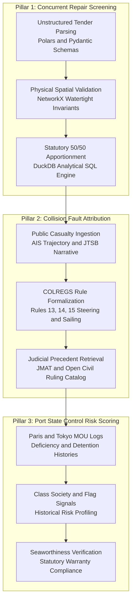
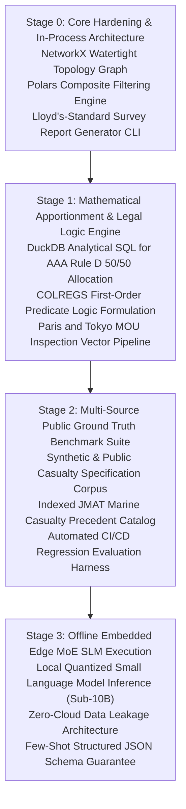

# Open-Core Research & Development Roadmap: MarineClaims AI

This document establishes the sequential development, algorithmic validation, and open-source benchmark roadmap for **MarineClaims AI (Open-Core)**. It details the progression from spatial graph integrity to a multi-source neuro-symbolic appraisal engine, specifying prerequisite milestones, entry/exit criteria, and automated verification gates without fixed calendar dates or schedules.

For the formalization of rules and spatial axioms, refer to [Symbolic AI Implementation Framework](symbolic_ai_implementation_framework.md).  
For underlying in-process mechanics, refer to [Technical Stack Architecture](technical_stack.md).  
For the continuous benchmark regression harness, refer to [Iterative Knowledge Loop Specification](iterative_knowledge_loop_specification.md).  
For prior academic literature grounding, refer to [Prior Research Synthesis](prior_research_synthesis.md).

---

## 1. Technical Vision & The Three Open-Core Pillars

MarineClaims AI provides an autonomous, auditable, and mathematically grounded decision-support engine. It replaces black-box, hallucination-prone generative models with a deterministic neuro-symbolic pipeline running on embedded, in-process Apache Arrow data streams.

1. **Pillar 1: Concurrent Repair Screening (H&M Claims)**:
   - Enforces physical watertight boundaries across ship compartments to mechanically reject impossible casualty damage extensions.
   - Computes deterministic drydock common expense apportionments based on statutory average adjusting rules (e.g., Rule D of the Association of Average Adjusters).
2. **Pillar 2: Collision Fault Attribution (Liability & Subrogation)**:
   - Formulates the International Regulations for Preventing Collisions at Sea (COLREGS Rules 5–19) into first-order predicate logic.
   - Pairs logic checking with hybrid BM25 and dense vector retrieval over public Japan Marine Accident Tribunal (JMAT) decisions and open civil court precedents.
3. **Pillar 3: Port State Control Risk Scoring (Seaworthiness Compliance)**:
   - Evaluates latent unseaworthiness risks by analyzing multi-year Port State Control (Paris MOU and Tokyo MOU) inspection logs and statutory deficiency codes.

---

## 2. Phased Development Sequence (Order of Execution)

Development follows a strict dependency order: each stage delivers an independently testable, open-source technical capability required to unlock the next stage.

---

## 3. Stage Specifications, Prerequisites & Open-Core Deliverables

### Stage 0: Core Hardening & In-Process Architecture
- **Objective**: Establish the bedrock data structures and topological validation logic to eliminate parsing hallucinations and physical spatial false positives.
- **Prerequisites**: Baseline Python environment, sample unstructured drydock repair specifications, and vessel general arrangement drawings.
- **Key Deliverables**:
  1. **Watertight Spatial Graph**: Formally integrate `ontology/compartments.py` into the appraisal pipeline. Ensure physical watertight bulkheads reject causal links across non-adjacent compartments (e.g., Bow collision damage cannot justify Engine Room overhaul items).
  2. **Composite Discipline Filtering**: Enforce dual-attribute classification (`Discipline: Hull/Deck/Machinery` × `Compartment Location`), replacing naive keyword matching.
  3. **In-Process Arrow Memory Pipeline**: Standardize tabular data flow on Polars and DuckDB, maintaining zero-copy memory transfers without database server overhead.
  4. **Lloyd's-Standard Survey Report Generator**: Build a CLI export module producing publication-grade English preliminary survey reports formatted according to international average adjusting standards (`--export-report`).
- **Exit Gate (Gate 0: Core Stability)**:
  - 100% deterministic spatial rejection across all tested cross-bulkhead test pairs.
  - Zero-copy pipeline execution completing in under 3 seconds per specification.
  - Formatted preliminary survey report exported in clean Markdown.

### Stage 1: Mathematical Apportionment & Legal Logic Engine
- **Objective**: Codify international adjusting rules and maritime traffic regulations into mathematically auditable, deterministic solvers.
- **Prerequisites**: Completion of Stage 0; formal statutory rules text (AAA Rule D, COLREGS 1972, Tokyo/Paris MOU deficiency action codes).
- **Key Deliverables**:
  1. **Deterministic 50/50 Apportionment Engine**: Formalize dock dues, pumping, and general yard services into DuckDB analytical SQL expressions that divide shared costs strictly in accordance with AAA Rules of Practice **D5** (Issue #29; see [aaa_rule_d5_drydock_apportionment.md](aaa_rule_d5_drydock_apportionment.md)) when owner repairs are immediately necessary for seaworthiness, or when underwriters’ repairs are deferred to a routine docking.
  2. **COLREGS Predicate Logic Rules**: Encode Rules 13 (Overtaking), 14 (Head-on Situation), and 15 (Crossing Situation) as declarative logic constraints over relative bearing, speed, and aspect vectors.
  3. **PSC Deficiency Vector Ingestion**: Build a normalized ingestion parser for public Tokyo MOU and Paris MOU inspection reports, mapping deficiency codes to statutory ISM/SOLAS/MARPOL warranty clauses (Issue #31; see [psc_deficiency_vector.md](psc_deficiency_vector.md)).
- **Exit Gate (Gate 1: Mathematical & Logical Integrity)**:
  - Exact dual-apportionment mathematical reconciliation on synthetic multi-item drydock invoices.
  - 100% formal logical consistency on synthetic collision encounter geometries without heuristic LLM drift.

### Stage 2: Multi-Source Public Ground Truth Benchmark Suite
- **Objective**: Assemble a standardized, public, reproducible evaluation benchmark to measure precision, recall, and legal reasoning accuracy across maritime claim domains.
- **Prerequisites**: Completion of Stage 1; public domain access to JTSB marine accident reports, JMAT published decisions, and open drydock tenders.
- **Key Deliverables**:
  1. **Open Repair Specification Dataset**: Curate and synthesize 20+ diverse drydock specifications (bulk carrier, container, tanker, LNG) with verified ground-truth labels for casualty, wear & tear, and routine class survey items.
  2. **JMAT Decision Catalog**: Index 50+ published marine tribunal rulings with verified fault ratios, navigational geometries, and legal rationale vectors in LanceDB.
  3. **Automated CI/CD Evaluation Harness**: Implement an automated test runner executing end-to-end appraisal against the ground-truth suite, measuring precision, recall, and false-accept rates on every pull request.
- **Exit Gate (Gate 2: Benchmark Reproducibility)**:
  - Public test suite running deterministically in GitHub Actions CI.
  - Classification precision ≥ 90% and severe false accepts = 0 on the public benchmark corpus.

### Stage 3: Offline Embedded Edge MoE SLM Execution
- **Objective**: Guarantee complete data privacy and offline operational capability by executing extraction and reasoning via quantized small language models running locally in-process.
- **Prerequisites**: Completion of Stage 2; quantized sub-10B parameter model weights (e.g., Qwen 2.5 MoE, Llama 3.2 3B).
- **Key Deliverables**:
  1. **Local Model Runtime**: Implement in-process inference connectors utilizing llama.cpp or ONNX Runtime, eliminating any requirement for external cloud API calls.
  2. **Few-Shot Schema Enforcer**: Formulate 3-shot domain-specific prompt exemplars that guarantee strict Pydantic JSON serialization from local SLMs.
  3. **Zero-Cloud Air-Gapped Validation**: Validate that the entire engine functions identically in an air-gapped environment with internet access disabled.
- **Exit Gate (Gate 3: Offline Operational Readiness)**:
  - 100% offline test execution with zero external network socket requests.
  - Schema adherence rate of 100% across all benchmark extraction tasks.
  - End-to-end local inference latency under 15 seconds per repair specification.

---

## 4. Technical Verification Gate Matrix (Open-Core)

| Gate | Stage | Core Target Criteria | Minimum Threshold | Target Optimal |
| :--- | :--- | :--- | :--- | :--- |
| **Gate 0** | Stage 0 (Core Hardening) | Spatial Boundary Rejection (Cross-Bulkhead) | 100% Deterministic | 100% Deterministic |
| | | Preliminary Survey Report Generation | Valid Markdown Export | Publication-Grade Lloyd's Style |
| | | Pipeline Execution Latency | ≤ 5.0 Seconds | ≤ 2.0 Seconds |
| **Gate 1** | Stage 1 (Logic Engine) | AAA Rule D 50/50 Math Apportionment | 100% Reconciled | 100% Reconciled |
| | | COLREGS Encounter Logic Validation | 100% Soundness | 100% Soundness |
| | | PSC Deficiency Code Normalization | 100% Schema Compliant | 100% Schema Compliant |
| **Gate 2** | Stage 2 (Public Benchmarks)| Public Benchmark Precision | ≥ 85% Precision | ≥ 92% Precision |
| | | Severe False Accepts (Hull → Engine) | 0 items | 0 items |
| | | Automated CI/CD Regression Coverage | All Core Pipelines | Full Suite with Code Coverage |
| **Gate 3** | Stage 3 (Edge SLM) | Offline / Air-Gapped Execution | 100% Local (0 Sockets) | 100% Local (0 Sockets) |
| | | Local SLM JSON Schema Adherence | ≥ 98% Valid Output | 100% Valid Pydantic JSON |
| | | Local Inference Latency (CPU/GPU) | ≤ 30 Seconds | ≤ 15 Seconds |
