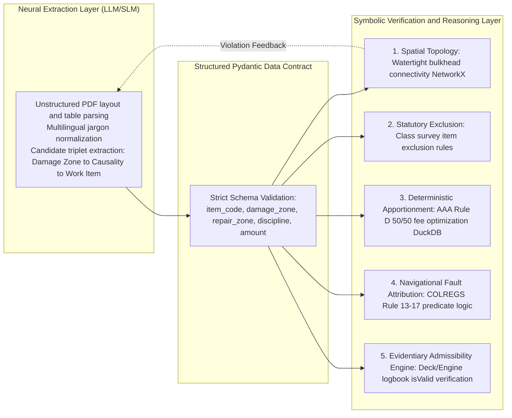
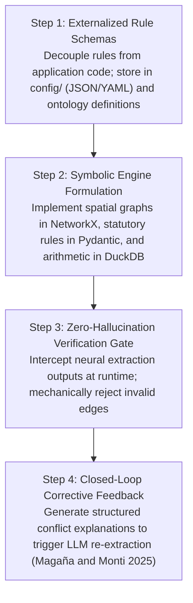
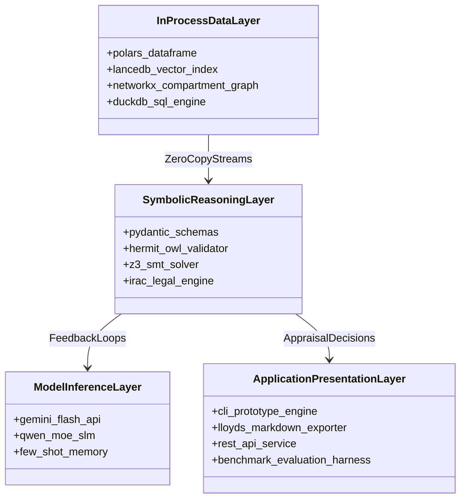

# Symbolic AI Implementation Framework: Knowledge Engineering, Rule Acquisition & Formalization

This document defines the theoretical principles, primary ground-truth sources, and engineering methodologies for constructing the **Symbolic AI and Knowledge Representation Layer** of **MarineClaims AI**. It provides the implementation blueprint for physical, statutory, mathematical, and navigational invariants where probabilistic reasoning is insufficient and zero hallucination is mandatory.

For the phased execution sequence and business gates, refer to [Research & Development Strategic Roadmap](research_and_development_roadmap.md).

---

## 1. Division of Responsibilities: Neural Extraction vs. Symbolic Verification

A foundational tenet of MarineClaims AI is the strict division of labor between neural perception and symbolic reasoning:

- **Neural Models (LLM / SLM)**: Excel at statistical pattern recognition, OCR text cleanup, shipyard vernacular normalization (e.g., Japanese shipyard terms like "ケレン", "目皿", "メガ", "抜出"), and candidate triplet extraction into structured JSON/Pydantic schemas.
- **Symbolic AI (Deterministic Logic & Solvers)**: Handles all non-negotiable physical laws, statutory exclusion covenants, mathematical fee apportionments, and judicial navigation rules where deterministic auditability is required.



---

## 2. The Five Symbolic Domains & Primary Ground-Truth Sources (What to Collect)

To construct a legally and technically defensible symbolic engine, rules cannot be inferred statistically; they must be formalized directly from authoritative maritime conventions, statutory regulations, and naval architecture standards:

| # | Symbolic Domain | Problem Solved & Business Purpose | Primary Ground-Truth Sources to Collect | Computable Data Representation |
| :--- | :--- | :--- | :--- | :--- |
| **1** | **Vessel Spatial Topology** | Mechanically prevents attributing bow collision damage to remote compartments (eliminates False Accepts). | ・**SOLAS Convention Chapter II-1** (Watertight bulkhead & collision barrier standards)<br>・**Classification Society Rules** (ClassNK / DNV hull construction rules)<br>・Vessel General Arrangement (GA) and Midship Section drawings | **Undirected Adjacency Graph**<br>(NetworkX: G = (V, E) with isolated machinery nodes) |
| **2** | **Statutory Periodicity Exclusions** | Disallows routine scheduled overhauls (piston pulls, megger tests) slipped into casualty accounts. | ・**Ship Safety Law & Enforcement Regulations**<br>・**ClassNK Rules Part B Chapter 2** (Mandatory intermediate & special survey items)<br>・Public tender standard drydock repair specifications | **Exclusion Taxonomy & Schemas**<br>(`config/statutory_rules.json` / Pydantic) |
| **3** | **Common Drydock Fee Apportionment** | Enforces the international 50/50 division of common docking expenses between owner and underwriter. | ・**Association of Average Adjusters (AAA) Rules of Practice Rule D**<br>・**Marine Insurance Act 1906 / 2015**<br>・**Institute Time Clauses - Hulls (ITC-Hulls 1/10/83)** | **MaxSMT Constraints & SQL**<br>(DuckDB deterministic apportionment queries) |
| **4** | **Collision Fault Attribution** | Automates initial liability splits (e.g., 80:20 crossing) based on codified navigational regulations. | ・**COLREGS 1972** (Rules 13 to 17: Overtaking, Head-on, Crossing situations)<br>・**Japan Marine Accident Tribunal (JMAT) Precedent Archive**<br>・Civil Court Collision Fault Assessment Tables | **First-Order Predicate Logic**<br>(Rule-based decision trees with angle/speed inputs) |
| **5** | **Evidentiary Admissibility** | Verifies whether damage photos, surveyor notes, and logbooks satisfy legal burden of proof. | ・International Marine Surveying Guidelines<br>・Civil Procedure Code on documentary evidence authentication | **Relational Knowledge Graph Nodes**<br>(Graph attributes: `isValid`, `reasonForInvalid`) |

> [!NOTE]
> **International Harmonization & Domestic Ground Truth**: International conventions (IMO COLREGS 1972, SOLAS Chapter II-1) are directly transposed into Japanese domestic law (*海上衝突予防法*, *船舶安全法*) with identical mathematical thresholds (e.g., 22.5° overtaking sector) and navigational duties. Because Japanese maritime tribunals (JMAT) and courts publish open-access fact-findings and liability splits, Japanese judicial records serve as an internationally valid, open-access benchmark for the core reasoning engine. For a detailed legal-technical analysis, refer to [Public Datasets & Accuracy Evaluation Methodology](public_benchmarks_and_accuracy_evaluation.md#5-jurisprudential-grounding-international-conventions-japanese-law-and-strategic-benchmark-selection).

---

## 3. Formalization & Construction Methodology (How to Build It)

The formalization of maritime rules into running software proceeds through a four-stage engineering pipeline:



### Stage 1: Externalized Rule Schemas (`config/`)
Rules are strictly decoupled from executable code to allow review, audit, and adjustment by senior average adjusters and maritime lawyers without redeploying binaries:
- **Example (`config/statutory_rules.json`)**:

  ```json
  {
    "statutory_exclusions": [
      {
        "code": "STAT-ENG-01",
        "pattern_keywords": ["ピストン抜出", "クランク軸芯出し", "開放点検", "メガテスト", "安全弁整備"],
        "class_reference": "ClassNK Rules Part B Chapter 2 (Periodical Survey)",
        "verdict": "EXCLUDED",
        "reason": "Statutory periodic overhaul cannot be justified by external collision without direct physical bulkhead breach."
      }
    ]
  }
  ```

### Stage 2: Concrete Engine Formulation
1. **Spatial Topology Graph (`src/marine_claims_ai/ontology/compartments.py`)**:
   - Represents compartments as nodes and structural adjacencies as edges.
   - Machinery space is isolated by transverse watertight bulkheads.
   - Evaluated in sub-millisecond execution via `nx.has_path(graph, source, target)`.
2. **Deterministic Fee Apportionment (`src/marine_claims_ai/analytics/apportion.py`)**:
   - Implements AAA Rule D as deterministic DuckDB SQL queries. Common drydock dues are apportioned 50/50 when both casualty and owner maintenance work required drydocking.
3. **COLREGS Predicate Engine**:
   - Calculates relative bearing and heading vectors between encountering vessels.
   - Maps facts directly to formal predicate implications:

     ```text
     PowerDriven(A) and PowerDriven(B) and Crossing(A, B) and BearingStarboard(A, B)
     => GiveWay(A) and StandOn(B)
     ```

### Stage 3: Zero-Hallucination Verification Gate
- Every candidate repair item extracted by the neural model is intercepted before reaching the financial appraisal tally.
- If an item proposes `COVERED` for an engine room component while casualty damage is isolated to `hull_forward`, the topological barrier invariant mechanically overrides the label to `EXCLUDED (Concurrent Repair)`.

### Stage 4: Closed-Loop Corrective Feedback
- Drawing from Magaña & Monti (2025), when a violation occurs, the symbolic reasoner generates a minimal conflict explanation (e.g., `watertight_barrier_violation: forward_hull cannot propagate to machinery_space`).
- This explanation is reinjected into the prompt context, forcing the extractor to correct its output while preserving an immutable audit log.

---

## 4. Technology Stack Evolution



- **Open-Core Layer**: Embedded, serverless Python/Rust pipeline utilizing Apache Arrow in-process memory buffers (Polars, LanceDB, NetworkX, DuckDB) paired with local or API-driven language model inference.
- **Edge Runtime**: Fully offline, air-gapped local execution support using quantized sub-10B parameter Small Language Models (MoE SLMs) to guarantee zero data leakage on sensitive maritime documents.

---

## 5. Scientific Literature Integration Matrix

| Scientific Principle | Source Literature | Concrete Implementation in MarineClaims AI |
| :--- | :--- | :--- |
| **Guided Predicate Logic** | Kant et al. (Stanford CodeX, 2025) | Replacing unguided LLM reasoning with strict Pydantic/Prolog schemas to enforce policy exclusions (wear & tear, intentional acts, statutory survey items). |
| **Closed-Loop Spatial Ontologies** | Magaña & Monti (IBM / UNIBZ, 2025) | Modeling vessel compartments as topological graphs; generating minimal conflict explanations when physical watertight bulkheads are violated, driving automated extraction self-refinement. |
| **MaxSMT Compliance & Minimal Optimization** | Hsia, Yu & Jiang (NCCU / NTU, 2026) | Formulating insurance covenants as hard constraints and yard invoice items as soft constraints, computing minimal adjustments required to resolve claims leakage. |
| **Efficient In-Process MoE SLMs** | Vaddi (2026) | Deploying 3B–8B parameter Mixture-of-Experts models with Few-Shot prompting instead of expensive, latency-prone, and data-leaking frontier cloud models. |
| **Claim Knowledge Graphs & GraphRAG** | Wang & Fang (Buildings, 2026) | Structuring claims into 5 core classes (`Claim Event`, `Party`, `Claim`, `Evidence Material`, `Contract/Law/Regulation`) with strict `isValid` evidentiary admissibility tracking. |
