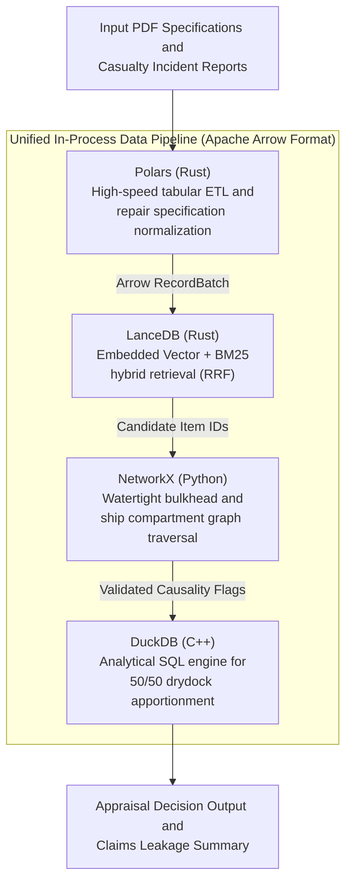
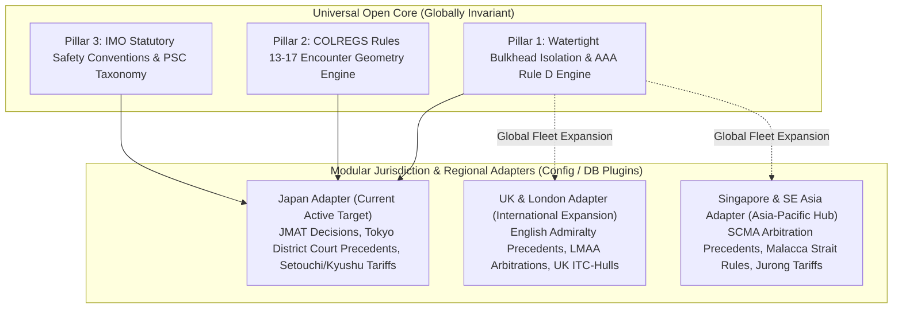

# Technical Stack Architecture: Public Open-Core

This document details the open-core architectural foundation, data processing pipelines, and analytical engine powering **MarineClaims AI**.

---

## 1. Architectural Philosophy: The Apache Arrow Foundation

The core pipeline operates entirely on an **embedded, serverless data stack** unified by the **Apache Arrow** columnar format. This enables zero-copy, in-process interoperability between tabular data extraction, hybrid information retrieval, physical graph constraint traversal, and analytical insurance calculations—all without requiring external database servers or Docker containers.



---

## 2. Component Breakdown & Responsibilities

### 1. Data Normalization & Extraction: Polars
- **Role**: High-performance extraction, data typing, and structural normalization of multi-page drydock repair tenders and casualty reports.
- **Key Capabilities**:
  - Blazing-fast execution implemented in Rust, operating 10–50x faster than traditional Pandas with negligible memory overhead.
  - Converts unstructured PDF tables into strictly typed Arrow schemas (`section`, `item_code`, `description`, `trade_discipline`, `cost_estimate`).
  - Seamless zero-copy data passing to LanceDB and DuckDB via Arrow memory buffers.

### 2. Domain Hybrid Search: LanceDB
- **Role**: Embedded vector database and keyword search engine for maritime specifications.
- **Key Capabilities**:
  - **Zero Server Overhead**: Runs entirely in-process (`pip install lancedb`), persisting data to local cache directories.
  - **Hybrid Search (BM25 + Vector)**: Combines exact keyword matching (via built-in Tantivy search) with semantic embedding vectors using Reciprocal Rank Fusion (RRF).
  - Essential for maritime terminology where exact phrase matching (`Sea chest valve`, `Piston crown overhaul`, `COLREGS Rule 14`) must be balanced with semantic damage descriptions.

### 3. Physical Constraint Validation: NetworkX
- **Role**: Deterministic graph traversal engine encoding naval architecture spatial hierarchies and watertight boundaries.
- **Key Capabilities**:
  - Models the vessel as a directed graph (G = (V, E)), where nodes represent ship compartments/components and edges represent physical connectivity and watertight bulkheads.
  - **Zero-Hallucination Barrier**: Mechanically verifies whether physical casualty damage (e.g., forward bulbous bow abrasion) can propagate to claim repair items across watertight bulkheads (`nx.has_path(G, source, target)`).
  - Instantly filters out ungrounded causal links proposed by generative models before financial calculation.

### 4. Financial Apportionment & Analytics: DuckDB
- **Role**: In-process analytical SQL engine for drydock fee apportionment and claims leakage calculations.
- **Key Capabilities**:
  - Executes deterministic insurance apportionment rules (e.g., standard 50/50 drydocking fee division between casualty repairs and concurrent owner maintenance).
  - Fast SQL aggregation over itemized shipyard accounts, calculating deductible offsets, trade-discipline subtotals, and total leakage reductions.
  - Direct zero-copy queries over Arrow tables returned by Polars and LanceDB.

### 5. Detailed Database Architecture & Lifecycle Specification

For an in-depth breakdown of database design rationales, internal storage formats, programmatic update pipelines, and query workflows, consult:
👉 [**Database Architecture, Design Rationales & Lifecycle Management (`database_architecture_and_lifecycle.md`)**](database_architecture_and_lifecycle.md)

| Database | Primary Purpose | Key Architectural Design Intent | Update / Write Workflow | Query / Read Workflow |
| :--- | :--- | :--- | :--- | :--- |
| **DuckDB**<br>(`_inputs/*.duckdb`) | • AAA Rule D5 50/50 drydock dues apportionment<br>• Claims leakage & financial audit aggregation | • Embedded C++ in-process (Zero-Server)<br>• Arrow zero-copy memory integration<br>• Zero-Dataset Git Policy compliance | • `scripts/init_duckdb_vector.py --force`<br>• `build_duckdb_analytics()` via Arrow buffer<br>• Compiles `DRYDOCK_APPORTIONMENT_VIEW_SQL` | • `summarize_claims_leakage()` (`read_only=True`)<br>• In-memory dynamic query via `duckdb.connect(":memory:")` |
| **LanceDB**<br>(`.lancedb/`) | • Dense Vector (384-dim) + BM25 hybrid search<br>• JMAT rulings, PSC flags, repair packages retrieval | • Embedded Rust in-process engine<br>• Tantivy full-text index integration<br>• Cloudflare R2 / S3 native backup sync | • `build_lancedb()` with fastembed MiniLM-L12-v2<br>• `create_table("precedents", mode="overwrite")`<br>• `table.create_index("text", config=FTS())` | • `hybrid_search(query_text, k)`<br>• Vector + BM25 search fused via `RRFReranker()` |
| **NetworkX**<br>(In-Memory) | • SOLAS watertight bulkhead topology validation<br>• Mechanical exclusion of physical non-causality | • Deterministic graph invariant barrier<br>• Zero-hallucination guarantee on damage spread | • `build_standard_vessel_compartment_graph()`<br>• Instantiates vessel compartments & bulkhead edges | • `nx.has_path(view, impact_node, repair_node)`<br>• Flags disconnected repairs as `EXCLUDED` |

---

## 3. Two-Tier System Architecture: Universal Core vs. Jurisdiction Adapters

To guarantee international portability across global maritime hubs while anchoring accuracy against rigorous judicial benchmarks, the architecture enforces a strict decoupling between **Universal Open-Core Engines** and **Modular Jurisdiction/Regional Adapters**:



### Architectural Separation Matrix

| Functional Pillar | Universal Open Core (Globally Invariant) | Jurisdiction & Regional Adapters (Modular Plugins) |
| :--- | :--- | :--- |
| **Pillar 1: Concurrent Repair & Drydock Apportionment** | • **Physical Compartment Invariants**: Transverse watertight bulkhead barriers (SOLAS II-1) preventing causality across isolated compartments.<br>• **Statutory Survey Intervals**: IACS unified periodic survey cycles (Special Survey 5 years, Intermediate Survey 2.5 years) and mandatory inspection items (piston pulls, tailshafts).<br>• **Statutory 50/50 Apportionment**: Association of Average Adjusters (AAA) Rule D mathematical logic for dual-necessity common docking dues.<br>• **Standard Work Breakdown**: SFI group classification system for hull, engine, and electrical trades. | • **Shipyard Man-Hour Tariffs (Regional Rates)**:<br>  - Japan (Setouchi/Kyushu): Approx. 4,500–6,500 JPY/hr.<br>  - Singapore (Jurong): Approx. 35–50 USD/hr.<br>  - China (Zhoushan/Nantong): Approx. 18–28 USD/hr.<br>• **Local Dock Tariff Structure**: Daily lay-docking fee vs. tonnage lump-sum conventions.<br>• **Policy Wordings & Forms**: Japanese Hull Clauses (NK Form) vs. English Institute Time Clauses - Hulls (ITC-Hulls 1/10/83, 1995) vs. Nordic Marine Insurance Plan. |
| **Pillar 2: Collision Fault Attribution & Legal Reasoning** | • **Steering & Sailing Regulations**: COLREGS 1972 Part B (Rule 13 Overtaking > 22.5° abaft the beam, Rule 14 Head-on mutual starboard alteration, Rule 15 Crossing starboard give-way).<br>• **Nautical Telemetry Analytics**: Mathematical computation of Relative Bearing, Course Difference, CPA (Closest Point of Approach), and TCPA from AIS/VDR records.<br>• **Proportional Fault Doctrine**: Core principle of 1910 Collision Convention dividing damages proportionally to fault degree. | • **Judicial Precedent Catalog (Fault Splits)**:<br>  - Japan: JMAT tribunal decisions & civil court precedent catalog.<br>  - UK: English Admiralty Court precedents & LMAA arbitration awards.<br>  - Singapore: SCMA maritime arbitration awards & High Court rulings.<br>• **Contributory Negligence Nuance**: Local judicial discretion on discretionary adjustment percentages (e.g., standard +10% increments for night lookout defaults).<br>• **Fairway Special Regulations**: Local transit rules (Japan Maritime Traffic Safety Act for Uraga/Kanmon vs. Singapore Strait TSS rules vs. Dover Strait CALDOVREP). |
| **Pillar 3: PSC Risk Scoring & Warranty of Seaworthiness** | • **International Convention Treaties**: SOLAS, MARPOL, STCW, and ISM Code text and mandatory safety standards.<br>• **PSC Deficiency & Action Codes**: IMO Resolution A.1155(32) 5-digit category taxonomy (011xx, 041xx, 071xx, 131xx, 151xx) and standardized action codes (Code 17 rectify, Code 30 detention).<br>• **Baseline Severity Weights**: Algorithmic weighting of safety-critical systems (steering gear, emergency fire pumps, SMS non-conformities). | • **Regional MOU Inspection Priorities**: Tokyo MOU vs. Paris MOU vs. US Coast Guard (Qualship 21) annual Concentrated Inspection Campaigns (CIC).<br>• **Legal Thresholds for Warranty Breach**:<br>  - English Law (MIA 1906 Sec 39): Absolute warranty on voyage policies; requiring "privity of the assured" on time policies.<br>  - Japanese Law (Commercial Code Art 815): Carrier due-diligence and burden-of-proof standards.<br>  - Nordic Law (Nordic Plan): Stricter proximate causation requirements. |

### Technical Debt Elimination Guarantee

1. **Zero Core Logic Rewrite**: Core calculation and constraint engines (`ontology/compartments.py`, `legal/colregs_engine.py`, `analytics/rule_d_solver.py`) are strictly decoupled from jurisdiction-specific rules.
2. **Configuration-Driven Adaptation**: Deploying to a new maritime cluster (e.g., London or Singapore) requires only populating an external jurisdiction vector table in LanceDB and supplying local shipyard tariff schedules in YAML.
3. **Soundness Verification**: Benchmarking against Japanese open-access judicial records proves the soundness of the underlying COLREGS and SOLAS logic, ensuring instantaneous credibility when presenting to international marine underwriters.

---

## 4. Deployment & Execution Characteristics

- **Zero External Dependencies**: Operates entirely within standard Python virtual environments (`>= 3.11`) without requiring background daemons, Docker runtime, or external network connections during verification.
- **Local Isolation**: All caches and intermediate database files reside in local, gitignored directories (`_inputs/`, `datasets/`, `.lancedb/`).
- **Reproducibility**: Multi-field benchmark test suites (`verify_3fields_benchmarks.py`) run reproducibly across Linux and macOS developer workstations.

---

## 5. Local Database Persistence & Backup Strategy

In alignment with our **Zero-Dataset Git Policy**, binary database files (`*.duckdb`, `.lancedb/`) and downloaded public files are strictly excluded from version control.

### A. Idempotent Rebuild (Code as Source of Truth)

- The primary backup mechanism is **deterministic programmatic re-generation**.
- Any developer or CI runner can reconstruct the entire local database state from scratch at any time:

  ```bash
  # 1. Re-fetch public datasets into local cache (JMAT full index + JTSB ≤200 by default)
  uv run python scripts/fetch_public_datasets.py --force

  # 2. Re-index local DuckDB & LanceDB tables
  uv run python scripts/init_duckdb_vector.py --force

  # 3. Optional: measure retrieval hit@k on a fixed query set
  uv run python scripts/eval_retrieval_scale.py
  ```

- Because no proprietary state is held in the open-core repo, rebuild scripts eliminate the need for storing multi-gigabyte binary database dumps in Git.

### B. Developer Local Snapshotting

For local developers wishing to freeze or preserve a specific experimental database state across machines:

- **LanceDB**: The `.lancedb/` directory contains self-contained Arrow/Lance datasets. Compressing the directory preserves full index and metadata state:

  ```bash
  tar -czf lancedb_snapshot_$(date +%Y%m%d).tar.gz .lancedb/
  ```

- **DuckDB**: Use the native zero-overhead SQL export command:

  ```sql
  EXPORT DATABASE 'backup/duckdb_snapshot/' (FORMAT PARQUET);
  ```

Snapshots must remain in local gitignored folders and must never be committed to Git.

### D. Corpus Scale & Retrieval Accuracy

Public corpora are intentionally fetched on demand (Zero-Dataset policy). To test whether hybrid retrieval improves with volume:

1. Fetch a thin slice (`--limit 20`) and rebuild LanceDB; run `eval_retrieval_scale.py` → save as baseline.
2. Re-fetch at DoD scale (JMAT full major index; JTSB ≥200 collision reports; civil ≥20 seeds) and rebuild with `--force`.
3. Re-run evaluation with `--baseline` to report hit@5 / hit@10 deltas.

Corpus scale experiments (local only): thin caches used for before/after hit@k
comparisons may show that **more rows do not automatically raise hit@k** when the
query set already saturates on a small corpus, or when added domains dilute RRF
ranks. Treat deltas as diagnostic, not as a release gate.

### E. Civil precedents (fault ratios + yen)

Two tracked catalogs (metadata only; document binaries stay in gitignored `_inputs/`):

- `config/civil_precedent_catalog.json` — **real** `court_pdf` / `published_holding` with concrete document URLs (Field 4 realism eval).
- `config/civil_synthetic_benchmarks.json` — **synthetic_benchmark** rows for unit / regression tests only.

Field 4 fetch writes raw files under `_inputs/poc_datasets/civil_pdfs/` and `civil_html/` (response body unchanged) plus JSON sidecars with `local_path`. Do not mix lanes: synthetic patterns must not be labeled `published_holding`. Coverage: `uv run python scripts/civil_coverage.py --catalog`.

### F. Public appraisal accuracy (concurrent repair)

Tracked case list: `config/public_appraisal_eval.json` (≥3 public JTSB × drydock pairs). Item statuses are scored against **provisional founder gold v1** (`assign_provisional_gold_status`), which is intentionally separate from `appraisal/pipeline.py`. Critical False Accepts (e.g. calorifier / shaft covered on bow-only damage) must stay at 0.

```bash
uv run python scripts/eval_public_appraisal.py --fail-on-gate
```

### C. Cost-Effective Off-Machine Storage (Laptop Disaster Recovery)

To protect against workstation hardware loss (laptop disk failure or corruption) without violating the Zero-Dataset Git Policy:

- Developers can sync gitignored datasets, OCR caches, and database files directly to S3-compatible cloud object storage.
- **Cloudflare R2 (Recommended)**: Offers $0.015 / GB-month with **$0.00 egress fees** and a 10 GB free tier.
- **Backblaze B2 / AWS S3**: Backblaze B2 provides $0.006 / GB-month storage.
- **Synchronization Routine**: Use standard tools like `rclone` or `aws s3 sync`:

  ```bash
  # Sync downloaded datasets and local database state to remote bucket
  rclone sync datasets/ r2:marine-claims-public-cache/datasets/ --fast-list
  rclone sync .lancedb/ r2:marine-claims-public-cache/lancedb/ --fast-list
  ```
