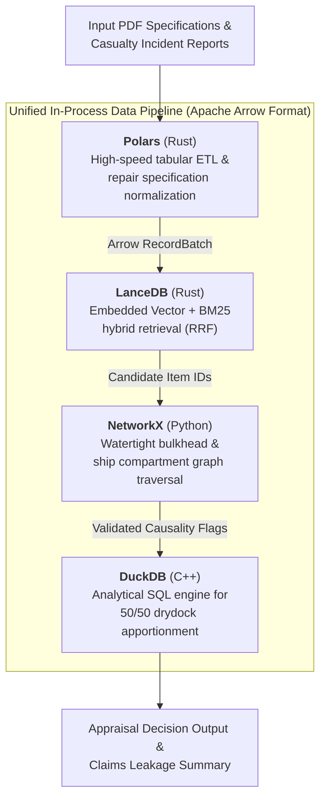

# Technical Stack Architecture: Public Open-Core

This document details the open-core architectural foundation, data processing pipelines, and analytical engine powering **MarineClaims AI**.

---

## 1. Architectural Philosophy: The Apache Arrow Foundation

The core pipeline operates entirely on an **embedded, serverless data stack** unified by the **Apache Arrow** columnar format. This enables zero-copy, in-process interoperability between tabular data extraction, hybrid information retrieval, physical graph constraint traversal, and analytical insurance calculations—all without requiring external database servers or Docker containers.



---

## 2. Component Breakdown & Responsibilities

### 1. Data Normalization & Extraction: Polars
- **Role**: High-performance extraction, data typing, and structural normalization of multi-page drydock repair tenders and casualty reports.
- **Key Capabilities**:
  - Blazing-fast execution implemented in Rust, operating 10–50x faster than traditional Pandas with negligible memory overhead.
  - Converts unstructured PDF tables into strictly typed Arrow schemas (`section`, `item_code`, `description`, `trade_discipline`, `cost_estimate`).
  - Seamless zero-copy data passing to LanceDB and DuckDB via Arrow memory buffers.

### 2. Domain Hybrid Search: LanceDB
- **Role**: Embedded vector database and keyword search engine for maritime specifications.
- **Key Capabilities**:
  - **Zero Server Overhead**: Runs entirely in-process (`pip install lancedb`), persisting data to local cache directories.
  - **Hybrid Search (BM25 + Vector)**: Combines exact keyword matching (via built-in Tantivy search) with semantic embedding vectors using Reciprocal Rank Fusion (RRF).
  - Essential for maritime terminology where exact phrase matching (`Sea chest valve`, `Piston crown overhaul`, `COLREGS Rule 14`) must be balanced with semantic damage descriptions.

### 3. Physical Constraint Validation: NetworkX
- **Role**: Deterministic graph traversal engine encoding naval architecture spatial hierarchies and watertight boundaries.
- **Key Capabilities**:
  - Models the vessel as a directed graph ($G = (V, E)$), where nodes represent ship compartments/components and edges represent physical connectivity and watertight bulkheads.
  - **Zero-Hallucination Barrier**: Mechanically verifies whether physical casualty damage (e.g., forward bulbous bow abrasion) can propagate to claim repair items across watertight bulkheads (`nx.has_path(G, source, target)`).
  - Instantly filters out ungrounded causal links proposed by generative models before financial calculation.

### 4. Financial Apportionment & Analytics: DuckDB
- **Role**: In-process analytical SQL engine for drydock fee apportionment and claims leakage calculations.
- **Key Capabilities**:
  - Executes deterministic insurance apportionment rules (e.g., standard 50/50 drydocking fee division between casualty repairs and concurrent owner maintenance).
  - Fast SQL aggregation over itemized shipyard accounts, calculating deductible offsets, trade-discipline subtotals, and total leakage reductions.
  - Direct zero-copy queries over Arrow tables returned by Polars and LanceDB.

---

## 3. Deployment & Execution Characteristics

- **Zero External Dependencies**: Operates entirely within standard Python virtual environments (`>= 3.11`) without requiring background daemons, Docker runtime, or external network connections during verification.
- **Local Isolation**: All caches and intermediate database files reside in local, gitignored directories (`_inputs/`, `datasets/`, `.lancedb/`).
- **Reproducibility**: Multi-field benchmark test suites (`verify_3fields_benchmarks.py`) run reproducibly across Linux and macOS developer workstations.

---

## 4. Local Database Persistence & Backup Strategy

In alignment with our **Zero-Dataset Git Policy**, binary database files (`*.duckdb`, `.lancedb/`) and downloaded public files are strictly excluded from version control.

### A. Idempotent Rebuild (Code as Source of Truth)
- The primary backup mechanism is **deterministic programmatic re-generation**.
- Any developer or CI runner can reconstruct the entire local database state from scratch at any time:
  ```bash
  # 1. Re-fetch public datasets into local cache
  uv run python scripts/fetch_public_datasets.py
  
  # 2. Re-index local DuckDB & LanceDB tables
  uv run python scripts/init_duckdb_vector.py --force
  ```
- Because no proprietary state is held in the open-core repo, rebuild scripts eliminate the need for storing multi-gigabyte binary database dumps in Git.

### B. Developer Local Snapshotting
For local developers wishing to freeze or preserve a specific experimental database state across machines:
- **LanceDB**: The `.lancedb/` directory contains self-contained Arrow/Lance datasets. Compressing the directory preserves full index and metadata state:
  ```bash
  tar -czf lancedb_snapshot_$(date +%Y%m%d).tar.gz .lancedb/
  ```
- **DuckDB**: Use the native zero-overhead SQL export command:
  ```sql
  EXPORT DATABASE 'backup/duckdb_snapshot/' (FORMAT PARQUET);
  ```
  *(Note: Snapshots must remain in local gitignored folders and must never be committed to Git.)*

### C. Cost-Effective Off-Machine Storage (Laptop Disaster Recovery)
To protect against workstation hardware loss (laptop disk failure or corruption) without violating the Zero-Dataset Git Policy:
- Developers can sync gitignored datasets, OCR caches, and database files directly to S3-compatible cloud object storage.
- **Cloudflare R2 (Recommended)**: Offers $0.015 / GB-month with **$0.00 egress fees** and a 10 GB free tier.
- **Backblaze B2 / AWS S3**: Backblaze B2 provides $0.006 / GB-month storage.
- **Synchronization Routine**: Use standard tools like `rclone` or `aws s3 sync`:
  ```bash
  # Sync downloaded datasets and local database state to remote bucket
  rclone sync datasets/ r2:marine-claims-public-cache/datasets/ --fast-list
  rclone sync .lancedb/ r2:marine-claims-public-cache/lancedb/ --fast-list
  ```

